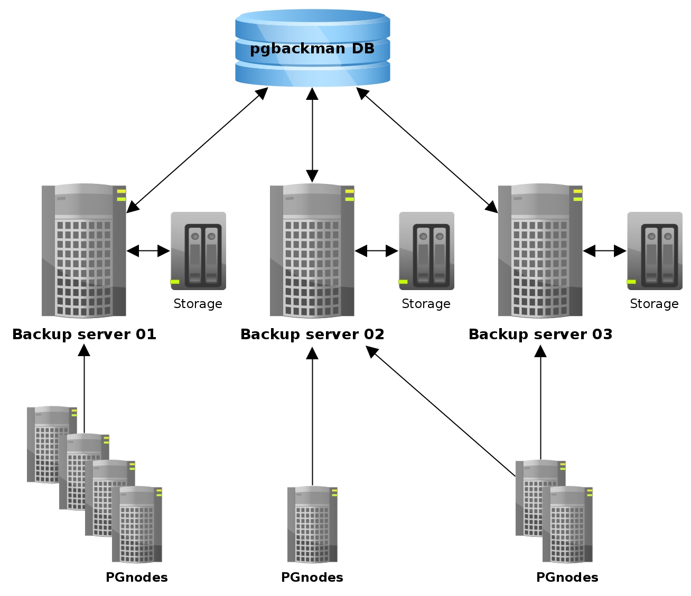
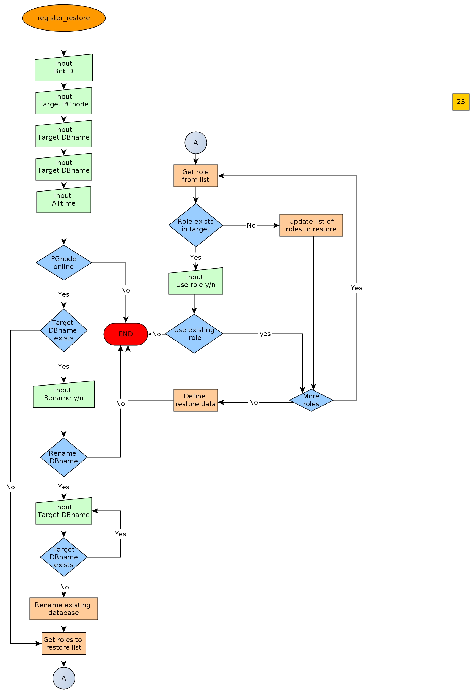

=====================================
PgBackMan - PostgreSQL Backup Manager
=====================================

|
| Version-1.0.0
|
| Author: Rafael Martinez Guerrero
| E-mail: rafael@postgresql.org.es
| Source: https://github.com/rafaelma/pgbackman
|

.. contents::

Introduction
============

PgBackMan is an open source tool to manage PostgreSQL backup dumps
created with ``pg_dump`` and ``pg_dumpall``.

It is designed to manage backups from thousands of databases running
in multiple PostgreSQL nodes, and it supports a multiple backup
servers topology.

It will also manage role and database configuration information when
creating a backup of a database.

Even though a backup created with ``pg_dump`` / ``pg_dumpall`` can never
guarantee a full disaster recovery of all data changed between the
moment when the backup was taken and the moment of a future crash,
they are still necessary if you need to archive versions of a database, move
databases between PgSQL nodes and clone databases between production /
pre-production and/or development servers.

They are also an easy way of taken backups of databases not requiring
PITR backups.
	
PgBackMan is not a tool for managing PITR (Point in time recovery)
backups. There are several other solutions out there that can be use
for PITR backups, such as PITRTools, OmniPITR, and Barman. 

Main features
=============

The main features of PgBackMan are:

* Central database with metadata information.
* PgBackMan shell for interaction with the system.

* Management of multiple backup servers
* Management of multiple PostgreSQL servers
* Management of thousands of backups dumps through a catalogue
* Manual and scheduled backups 
* Management of retention policies for backups dumps..
* Fully detailed backup reports.
* Multiple database backup types, CLUSTER, FULL, SCHEMA, DATA.
* Full backup of role information for a database.
* Full backup of database configuration for a database.
* Automatic definitions of backups for all databases running in a PgSQL node.
* Semi-automatic restore procedures
* Autonomous pgbackman_dump program that function even if the central database is not available.
* Handling of error situations.
* Totally written in Python and PL/PgSQL

Future features will include:

* Automatic cloning / move of databases between PgSQL nodes.
* Disk space management / planning 

Architecture and components
===========================

The components forming part of PgBackMan could be listed as follows:

* **Backup servers:** One or several backup servers running
  PgBackMan. All SQL dumps and logfiles are saved in these
  servers. They need access via ``libpq`` to the postgreSQL nodes that
  will be allow to have backups in a backup server.

* **PGnodes**: PostgreSQL servers running postgreSQL databases.

* **PgBackMan DB**: Central postgreSQL metadata database used by PgBackMan. All
  backup servers need access to this database.

* **PgBackMan shell:** This is a program that can be run in a text
  terminal. It can be run in any of the backup servers registered in
  the system. It is the console used to manage PgBackMan.

* **pgbackman_control:** This program runs in every backup server and
  takes care of updating crontab files and creating AT jobs when
  backup, snapshots or restore definitions are created.

* **pgbackman_maintenence:** This programs runs in every backup server
  and runs some maintenance jobs needed by PgBackMan.

* **pgbackman_dump:** This program runs in the backup servers when a backup
  or snapshot has to be taken.

* **pgbackman_restore:** This program runs in the backup servers when
  a restore has to be run.

Installation
============

You will have to install the requirements and the PgBackMan software
in all the servers that are going to be used as backup servers by
PgBackMan.

System requirements
-------------------

* Linux/Unix
* Python 2.6 or 2.7
* Python modules:
  - psycopg2
  - argparse
    
* PostgreSQL >= 9.0
* AT and CRON installed and running.

Before you install PgBackMan you have to install the software needed
by this tool

In systems using YUM::

  yum install python-psycopg2 python-argparse at

In system using apt-get::

  apt-get install python-psycopg2 python-argparse at

If you are going to install from source, you need to install also
these packages:

In systems using YUM::

  yum install python-devel python-setuptools

In system using apt-get::

  apt-get install python-devel python-setuptools

From source
-----------

The easiest way to install PgBackMan from source is to get the last
version from the master branch at the GitHub repository.

::

 [root@server]# cd
 [root@server]# git clone https://github.com/rafaelma/pgbackman.git

 [root@server]# cd pgbackman
 [root@server]# ./setup.py install
 .....

This will install all users, groups, programs, configuration files, logfiles and the
pgbackman module in your system.

Via RPM packages
----------------

RPM packages are available ...

Via Deb packages
----------------

Deb packages are available ...

pgbackman Database
------------------

After the requirements and the PgBackMan software are installed, you
have to install the pgbackman database in a server running PostgreSQL

You can get 

Configuration
=============

Backup servers
--------------

A backup server needs to have access to the ``pgbackman`` database and
to all PgSQL nodes is taken backups for. This can be done like this:

#. Update ``/etc/pgbackman/pgbackman.conf`` with the database
   parameters needed by PgBackMan to access the central metadata
   database. You need to define ``host`` or ``hostaddr``, ``port``,
   ``dbname``, ``database`` under the section
   ``[pgbackman_database]``.

   You can also define ``password`` in this section but we discourage
   to do this and recommend to define a ``.pgpass`` file in the home
   directory of the users ``root`` and ``pgbackman`` with this
   information, e.g.::

     dbhost.domain:5432:pgbackman:pgbackman_role_rw:PASSWORD

   and set the privileges of this file with ``chmod 400 ~/.pgpass``.

   Even a better solution will be to use the ``cert`` autentication for
   the pgbackman database user so we do not need to save passwords
   around.

#. Update and reload the ``pg_hba.conf`` file in the postgreSQL server
   running the pgbackman database, with a line that gives access to
   the pgbackman database from the new backup server. We recommend to
   use a SSL connection to encrypt all the trafikk between the database
   server and the backup server, e.g.::

     hostssl   pgbackman   pgbackman_role_rw    10.20.20.20.200/32     md5 

#. Define the backup server in PgBackMan via the PgBackMan shell::

     [pgbackman@pg-backup01 ~]# pgbackman

     ########################################################
     Welcome to the PostgreSQL Backup Manager shell (v.1.0.0)
     ########################################################
     Type help or \? to list commands.

     [pgbackman]$ register_backup_server
     --------------------------------------------------------
     # Hostname []: pg-backup01 
     # Domain [uio.no]: 
     # Remarks []: Main backup server

     # Are all values correct (yes/no): yes
     --------------------------------------------------------

     [Done]

     [pgbackman]$ show_backup_servers
     +-------+------------------+----------------------+
     | SrvID | FQDN               | Remarks            |
     +-------+--------------------+--------------------+
     | 00001 | pg-backup01.uio.no | Main backup server |
     +-------+------------------+----------------------+

#. Create the root directory / partition in the backup derver that
   will be used to save all backups, logfiles, and syem data needed by
   PgBackMan in

PgSQL nodes
-----------

Every PgSQL node defined in PgBackMan will need to update and reload
his ``pg_hba.conf`` file also to give access to the admin user
(``postgres`` per default) from the backup serveres defined in
PgBackMan, e.g.::

    hostssl   *   postgres    10.20.20.20.200/32     md5 

Remember that the ``.pgpass`` file of the ``pgbackman`` user in the
backup server has to be updated with the information needed to access
every PgSQL node we are goint to take backups for.

System administration and maintenance
=====================================

PgBackMan shell
===============

The PgBackMan interactive shell can be started by running the program
``/usr/bin/pgbackman``

::

   [pgbackman@pg-backup01]# pgbackman

   ########################################################
   Welcome to the PostgreSQL Backup Manager shell (v.1.0.0)
   ########################################################
   Type help or \? to list commands.
   
   [pgbackman]$ help
   
   Documented commands (type help <topic>):
   ========================================
   EOF                              show_backup_server_stats      
   clear                            show_backup_servers           
   delete_backup_definition_dbname  show_empty_backup_job_catalogs
   delete_backup_definition_id      show_history                  
   delete_backup_server             show_jobs_queue               
   delete_pgsql_node                show_pgbackman_config         
   quit                             show_pgbackman_stats          
   register_backup_definition       show_pgsql_node_config        
   register_backup_server           show_pgsql_node_stats         
   register_pgsql_node              show_pgsql_nodes              
   register_snapshot_definition     show_snapshot_definitions     
   shell                            update_backup_server          
   show_backup_catalog              update_backup_server_config   
   show_backup_definitions          update_pgsql_node             
   show_backup_details              update_pgsql_node_config      
   show_backup_server_config      
   
   Miscellaneous help topics:
   ==========================
   shortcuts
   
   Undocumented commands:
   ======================
   help
   
   [pgbackman]$ 

register_backup_server
----------------------

This command registers a backup server in PgBackMan::

  Command: register_backup_server [hostname] [domain] [remarks]

It can be run with or without parameters. e.g::

  [pgbackman]$ register_backup_server backup01 example.org "Test server"
 
  [pgbackman]$ register_backup_server
  --------------------------------------------------------
  # Hostname []: backup02
  # Domain [example.org]: 
  # Remarks []: Test server 2

  # Are all values correct (yes/no): yes
  --------------------------------------------------------

update_backup_server
--------------------

This command updates some parameters of a backup server defined in
PgbackMan::

  Command: update_backup_server [SrvID | FQDN] [remarks]

It can be run with or without parameters. e.g.::

  update_backup_server 1 "Main backup server"

  [pgbackman]$ update_backup_server
  --------------------------------------------------------
  # SrvID / FQDN []: 1
  # Remarks []: Main backup server

  # Are all values to update correct (yes/no): yes
  --------------------------------------------------------

You can use the backup server ID in PgBackMan or the FQDN to choose
the server to be updated.

update_backup_server_config
---------------------------

Not implemented.

delete_backup_server
--------------------

This command deletes a backup server defined in PgBackMan::

  Command: delete_backup_server [SrvID | FQDN]

It can be run with or without parameters. e.g.::

  [pgbackman]$ delete_backup_server 2

  [pgbackman]$ delete_backup_server
  --------------------------------------------------------
  # SrvID / FQDN: 2
  
  # Are you sure you want to delete this server? (yes/no): yes
  --------------------------------------------------------

You can use the backup server ID in PgBackMan or the FQDN to choose
the server to be deleted.

You will get an error if you try to delete a backup server that has
active backups in the catalog.

show_backup_servers 
---------------------

This command shows all the backup servers defined in PgbackMan

show_backup_server_config
-------------------------

This command shows the configuration parameters for a backup server.

It can be run with or without parameters. e.g.

show_backup_server_stats
------------------------

This command shows some statistics for a backup server defined in
PgBackMan.

register_pgsql_node
-------------------

update_pgsql_node
-----------------

update_pgsql_node_config
------------------------

delete_pgsql_node
-----------------

show_pgsql_nodes
----------------

show_pgsql_node_config
----------------------

show_pgsql_node_stats
---------------------

register_backup_definition
--------------------------

delete_backup_definition_id
---------------------------

delete_backup_definition_dbname
-------------------------------

show_backup_definition
----------------------

show_backup_catalog
-------------------

show_backup_details
-------------------

register_snapshot_definition
----------------------------

show_snapshot_definitions
-------------------------

show_empty_backup_catalogs
--------------------------

show_pgbackman_config
---------------------

show_pgbackman_stats
--------------------

register_restore_definition
----------------------------

This command defines a restore job of a backup from the catalog.

It will work with parameters only if there are not conflicts in the
definition.

There are some issues we have to take care when running a restore of a
backup. What happens if we want to restore a backup of a database or a
role that already exists in the target server?

This flowchar figure explains the logic used when restoring a backup
if our restore definition create some conflicts:

Submitting a bug
================

PgBakMan has been extensively tested, and is currently being used in
production at the University of Oslo. However, as any software,
PgBackMan is not bug free.

If you discover a bug, please file a bug through the GitHub Issue page
for the project at: https://github.com/rafaelma/pgbackman/issues

Authors
=======

In alphabetical order:

|
| Rafael Martinez Guerrero
| E-mail: rafael@postgresql.org.es / rafael@usit.uio.no
| PostgreSQL-es / University Center for Information Technology (USIT), University of Oslo, Norway
|

License and Contributions
=========================

PgBackMan is the property of Rafael Martinez Guerrero and
PostgreSQL-es and its code is distributed under GNU General Public
License 3.

Copyright © 2013-2014 Rafael Martinez Guerrero - PostgreSQL-es.
