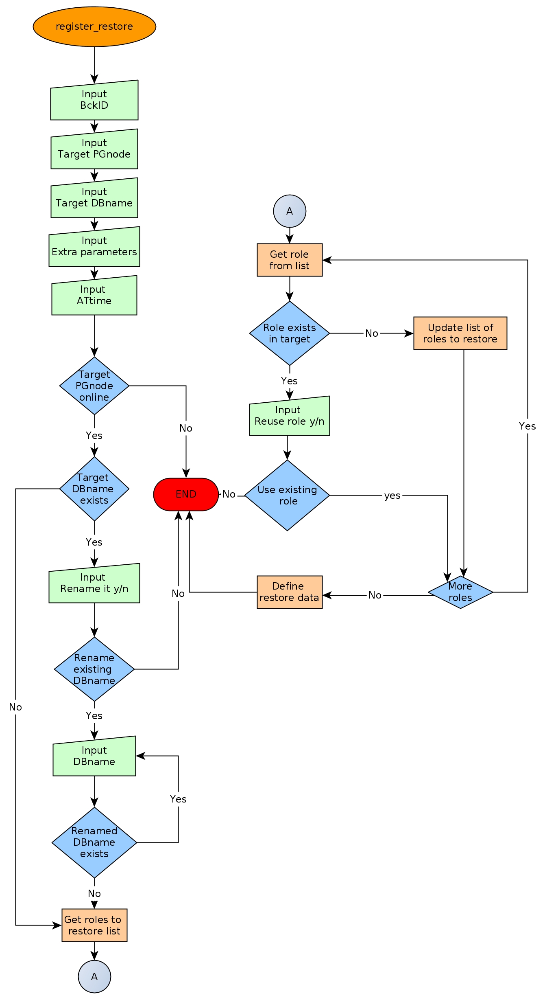

================================================
PgBackMan - Administrador de copias de seguridad
================================================

|
| Versión-1.0.0
|
| Autor: Rafael Martinez Guerrero (Universidad de Oslo)
| Correo electrónico: rafael@postgresql.org.es
| Código fuente: https://github.com/rafaelma/pgbackman
| Web: http://www.pgbackman.org/
|

.. contents::

Introducción
============

PgBackMan es una herramienta para administar copias de seguridad
lógicas de bases de datos PostgreSQL creadas con ``pg_dump`` y
``pg_dumpall``.

Está diseñada para administrar copias de seguridad de miles de bases
de datos, ejecutandose en múltiples servidores PostgreSQL, y soporta
una topologia con múltiples servidores de backups.

También administra la información relacionada con roles y
configuración asociada cuando crea una copia de seguridad de una base
de datos. Esta información es necesaria para garantizar una
restauración completa de una copia de seguridad lógica y todos los
elementos asociados a la misma.

Aunque una copia de seguridad creada con ``pg_dump`` o ``pg_dumpall``
no puede garantizar una restauración completa de todos los datos
modificados entre el momento que se creo la copia de seguridad y el
momento de un futuro desastre con perdida de datos, son necesarias si
queremos archivar una versión de una base de datos, mover bases de
datos entre servidores postgreSQL, clonar bases de datos entre
servidores de producción, pre-producción y desarrollo, o extraer los
datos de una base de datos en particular después de una restauración
PITR.

Las copias de seguridad lógicas son también una manera fácil de crear
copias de bases de datos que no necesiten copias de seguridad PITR
(Point in time recovery).

PgBackMan no es una herramienta para administrar copias de seguridad
PITR. Existen otras soluciones para administrar estas copias, como por
ejemplo PITRTools, OmniPITR, y Barman.

El código de PgBackMan está distribuido bajo una licencia "GNU General
Public License 3" y está escrito en Python y PL/PgSQL. Ha sido
desarrollado y comprobado por miembros del "Grupo de operaciones con
bases de datos" del "Centro de tecnologias de la información" en la
Universidad de Oslo.

Un ejemplo de un sistema que use PgBackMan puede verse en la siguiente
figura:

.. figure:: images/architecture.jpg
   :scale: 50%

Características principales
===========================

Las características principales de PgBackMan son:

* Base de datos central con los metadatos del sistema.
* Shell PgBackMan para la interacción con el sistema.
* Gestión de múltiples servidores de backups.
* Gestión de múltiples servidores PostgreSQL.
* Gestión de miles de copias de seguridad a través de un catálogo de copias.
* Copias de seguridad inmediatas y programadas.
* Gestión de políticas de retención para las copias de seguridad.
* Informes detallados de las copias de seguridad.
* Múltiples tipos de copias de seguridad predefinidos, CLUSTER,FULL,SCHEMA,DATA.
* Copia de seguridad completa de los datos asociados a los usuarios necesarios en el proceso de recuperacion de un backup.
* Copia de seguridad completa de los datos de configuración asociados a una base de datos y necesarios en el proceso de recuperación de un backup.
* Definiciones automáticas de copias de seguridad de todas las bases de datos disponibles en un servidor PostgreSQL.
* Restauración automática de backups.
* Programa pgbackman_dump autónomo que funciona incluso si la base de datos central con información de metadatos no está disponible.
* Manejo de situaciones de error.
* Programado en Python y PL/pgSQL.
* Distribuido bajo la GNU General Public License 3. 

Arquitectura y componentes
==========================

Los componentes que forman parte de PgBackman están listados a
continuación:

* **servidores de backups:** Uno o varios servidores de backups
  ejecutando PgBackMan. Todas las copias de seguridad y archivos de
  registro asociados están grabados en estos servidores. Necesitan
  acceso via ``lippq`` a todos los servidores PostgreSQL donde estos
  servidores vayan a tener acceso para realizar copias de seguridad y
  restauración de datos.

* **Nodos PgSQL:** Servidores PostgreSQL con diferentes bases de datos.

* **PgBackMan DB:**: Base de datos central usada por PgBackMan para
  grabar metadatos. Todos los servidores de backups necesitan acceso a
  esta base de datos.

* **PgBackMan shell:** Este es un programa que se ejecuta en modo
  texto desde una terminal. Se puede ejecutar en cualquiera de los
  servidores de backups definidos en el sistema. Es una consola que se
  utiliza para administrar PgBackMan.

* **pgbackman_control:** Este programa se ejecuta en todos los
  servidores de backups y es el encargado de actualizar archivos
  crontab y trabajos AT cuando:

  * Se definen copias de seguridad programas, inmediatas (snapshots) y
    trabajos de restauración de datos.

  * Nodos PgSQL son parados o borrados.

  * Definiciones de copias de seguridad son paradas o borradas.

* **pgbackman_maintenance:** Este programa se ejecuta en todos los
  servidores de backups y ejecuta algunos trabajos de mantenimiento
  necesarios para que PgBackMan funcione. Gestiona las políticas de
  retención de las copias de seguridad. Borra los archivos de copias y
  registros asociados a definiciones de copias de seguridad que sean
  borradas del catálogo con la opcion 'force'. Procesa todos los
  archivos de registro pendientes creados si la base de datos
  ``pgbackman`` no ha estado disponible cuando ``pgbackman_dump`` y
  ``pgbackman_restore`` se han estado ejecutando.

* **pgbackman_dump:** Este programa se ejecuta en los servidores de
  backup cuando se crea una copia de seguridad programada o snapshot.

* **pgbackman_restore:** Este programa se ejecuta en los servidores de
  backup cuando ejecutamos una restauración de datos.

La siguiente figura mustra todos lo componentes que forman parte de
PgBackMan y como interaccionan entre ellos.

.. figure:: images/components.jpg
   :scale: 50%

Instalación
===========

Tendreis que instalar PgBackMan en todas las máquinas que vayan a ser
usadas como servidores de backups por PgBackMan.

Requerimientos del sistema
--------------------------

* Linux/Unix
* Python 2.6 or 2.7
* Módulos Python:
  
  * psycopg2
  * argparse
    
* PostgreSQL >= 9.2 para la base de datos ``pgbackman``
* PostgreSQL >= 9.0 en todos los servidores PgSQL que vayan a utilizar
  PgBackMan para administrar sus copias de seguridad lógicas.
* AT y CRON instalados y ejecutandose.

Antes de instalar PgBackMan hay que instalar los programas requeridos
por el mismo.

En sistemas que usen ``yum``, e.g. Centos, RHEL, ...::

  yum install python-psycopg2 python-argparse at cronie

En sistemas que usen ``apt-get``, e.g. Debian, Ubuntu, ...::

  apt-get install python-psycopg2 python-argparse at cron

Si vais a instalar PgBackMan usando las fuentes, tendreis que instalar
tambien estos paquetes: ``python-dev(el), python-setuptools, git,
make, rst2pdf``

En sistemas que usen ``yum``::

  yum install python-devel python-setuptools git make rst2pdf

en sistemas que usen ``apt-get``::

  apt-get install python-dev python-setuptools git make rst2pdf

Instalando desde las fuentes
----------------------------

La manera más fácil de instalar PgBackMan desde las fuentes es
conseguir la última versión de la rama ``master`` en el repositorio
GitHub.

::

 [root@server]# cd
 [root@server]# git clone https://github.com/rafaelma/pgbackman.git

 [root@server]# cd pgbackman
 [root@server]# ./setup2.py install
 .....

Esto instalará todos los usuarios, grupos, programas, archivos de
configuración y el módulo de python pgbackman en tu sistema.

Instalando desde paquetes RPM
-----------------------------

Paquetes RPM para CentOS 6 y RHEL6 están disponibles en:
http://www.pgbackman.org/download.html

Instalar el paquete RPM con::

  [root@server]# rpm -Uvh pgbackman-<version>.rpm

Nota: Estamos trabajando para incluir los paquetes RPM de PgBackMan en
el repositorio oficial de PostgreSQL.

Instalando desde paquetes Deb
-----------------------------

Paquetes Deb para Debian7 están disponibles en:
http://www.pgbackman.org/download.html

Instalar el paquete Deb con::

  [root@server]# dpkg -i pgbackman_<version>.deb

Nota: Estamos trabajando para incluir los paquetes DEB de PgBackMan en
el repositorio oficial de PostgreSQL.

Instalando la base de datos pgbackman
-------------------------------------

Despues de instalar el software PgBackMan hay que instalar la base de
datos ``pgbackman`` en un servidor PostgreSQL. Esta base de datos es
el núcleo de la herramienta PgBackMan y es utilizada para grabar todos
los metadatos necesarios para que el sistema funcione.

El código de esta base de datos se puede obtener del directorio
``sql/`` en el código fuente de PgBackMan o del directorio
``/usr/share/pgbackman`` si has instalado PgBackMan desde las
``fuentes`` o paquetes ``rpm`` o ``deb``.

Para instalar la base de datos ``pgbackman`` podeis usar este comando:

::

   psql -h <dbhost.domain> -f /usr/share/pgbackman/pgbackman.sql

Antes de empezar a usar el sistema es recomendable actualizar los
valores por defecto de algunas parámetros de configuración. Los
valores de estos parámetros serán utilizados como valores por defecto
en la configuración de los servidores registrados en PgBackman.

Recomendamos actualizar estos tres parámetros con los valores que
querais tener en vuestra instalación PgBackMan::

  UPDATE pgsql_node_default_config SET value = 'address@your.domain' WHERE parameter = 'logs_email';
  UPDATE pgsql_node_default_config SET value = 'your.domain' WHERE parameter = 'domain';
  UPDATE backup_server_default_config SET value = 'your.domain' WHERE parameter = 'domain';

Estos valores son solamente los valores por defecto sugeridos cuando
se registra un nuevo servidor de backups og nodo PgSQL. En cualquier
momento se podrán actualizar usando el shell PgBackMan.

Configuración
=============

Servidores de backups
---------------------

Un servidor de backups necesita tener acceso a la base de datos
``pgbackman`` y a todos los nodos PgSQL en los cuales tenga que
realizar copias de seguridad o restauración de datos. 

A continuación teneis los pasos a seguir para configurar un servidor
de backups en PgBackMan:

#. Actualizar ``/etc/pgbackman/pgbackman.conf`` con los parámetros
   necesarios por PgBackMan para acceder la base de metadatos
   ``pgbackman``. Hay que definir ``host`` o ``hostaddr``, ``port``,
   ``dbname``, ``database`` en la seción ``[pgbackman_database]``.

   También se puede definir ``password`` en esta sección, pero
   desaconsejamos el uso de este parámetro en este archivo y
   recomendamos crear un archivo ``.pgpass`` en el directorio personal
   (home) de los usuarios ``root`` y ``pgbackman`` con esta
   información::

     <dbhost.domain>:5432:pgbackman:pgbackman_role_rw:<PASSWORD>

   No olvidar definir los privilegios de este archivo con ``chmod 400
   ~/.pgpass``.
 
   Una solución aun mejor seria el uso de la autentificación de tipo
   ``cert`` para el usuario usado para acceder la base datos
   ``pgbackman``. De esta manera evitariamos el tener que grabar los
   valores de las claves en texto plano.

#. Actualizar y recargar el archivo ``pg_hba.conf`` en el servidor
   PostgreSQL ejecutando la base de datos ``pgbackman``. Recomendamos
   usar una conexión SSL para cifrar el trafico entre el servidor de
   backup y la base de datos.::

     hostssl   pgbackman   pgbackman_role_rw    <backup_server_IP>/32     md5 

#. Instalar los clientes PostgreSQL para todas la versiones de
   PostgreSQL que querais soportar en el servidor de backups.
   PgBackMan puede realizar copias de seguridad de PostgreSQL siempre y
   cuando la versión del nodo PgSQL sea mayor o igual a
   9.0. Recomendamos utilizar los repositorios de PostgreSQL.org,
   http://yum.postgresql.org/ o http://apt.postgresql.org/ para
   instalar los paquetes cliente para las diferentes versiones.

#. Definir el servidor de backups en PgBackMan via el shell PgBackMan::

     [pgbackman@pg-backup01 ~]# pgbackman

     ########################################################
     Welcome to the PostgreSQL Backup Manager shell (v.1.0.0)
     ########################################################
     Type help or \? to list commands.

     [pgbackman]$ register_backup_server
     --------------------------------------------------------
     # Hostname []: pg-backup01 
     # Domain [uio.no]: 
     # Remarks []: Main backup server

     # Are all values correct (yes/no): yes
     --------------------------------------------------------

     [Done]

     [pgbackman]$ show_backup_servers
     +-------+------------------+----------------------+
     | SrvID | FQDN               | Remarks            |
     +-------+--------------------+--------------------+
     | 00001 | pg-backup01.uio.no | Main backup server |
     +-------+------------------+----------------------+

#. Comprobar que los parámetros de configuración del servidor de
   backup están definidos con los valores correctos. Por ejemplo,
   tendreis que actualizar los valores de los directorios con los
   programas clientes de PostgreSQL si usais Debian::

     [pgbackman]$ update_backup_server_config
     --------------------------------------------------------
     # SrvID / FQDN []: 1

     # PgSQL bindir 9.0 [/usr/pgsql-9.0/bin]: /usr/lib/postgresql/9.0/bin
     # PgSQL bindir 9.1 [/usr/pgsql-9.1/bin]: /usr/lib/postgresql/9.1/bin
     # PgSQL bindir 9.2 [/usr/pgsql-9.2/bin]: /usr/lib/postgresql/9.2/bin
     # PgSQL bindir 9.3 [/usr/pgsql-9.3/bin]: /usr/lib/postgresql/9.3/bin
     # PgSQL bindir 9.4 [/usr/pgsql-9.4/bin]: /usr/lib/postgresql/9.4/bin
     # Main backup dir [/srv/pgbackman]: 

     # Are all values to update correct (yes/no): yes
     --------------------------------------------------------
     
     [Done] Configuration parameters for SrvID: 1 updated.

     [pgbackman]$ show_backup_server_config
     --------------------------------------------------------
     # SrvID / FQDN: 1
     --------------------------------------------------------
     +-----------------------+-----------------------------+---------------------------------------------+
     | Parameter             | Value                       | Description                                 |
     +-----------------------+-----------------------------+---------------------------------------------+
     | admin_user            | postgres                    | postgreSQL admin user                       |
     | backup_server_status  | RUNNING                     | Default backup server status - *Not used*   |
     | domain                | example.net                 | Default domain                              |
     | pgbackman_dump        | /usr/bin/pgbackman_dump     | Program used to take backup dumps           |
     | pgbackman_restore     | /usr/bin/pgbackman_restore  | Program used to restore backup dumps        |
     | pgsql_bin_9_0         | /usr/lib/postgresql/9.0/bin | postgreSQL 9.0 bin directory                |
     | pgsql_bin_9_1         | /usr/lib/postgresql/9.1/bin | postgreSQL 9.1 bin directory                |
     | pgsql_bin_9_2         | /usr/lib/postgresql/9.2/bin | postgreSQL 9.2 bin directory                |
     | pgsql_bin_9_3         | /usr/lib/postgresql/9.3/bin | postgreSQL 9.3 bin directory                |
     | pgsql_bin_9_4         | /usr/lib/postgresql/9.4/bin | postgreSQL 9.4 bin directory                |
     | root_backup_partition | /srv/pgbackman              | Main partition used by pgbackman            |
     | root_cron_file        | /etc/cron.d/pgbackman       | Crontab file used by pgbackman - *Not used* |
     +-----------------------+-----------------------------+---------------------------------------------+

#. Crear el directorio o partición en el servidor de backups que será
   usada para grabar todas las copias de seguridad, archivos de
   registro y datos de sistema usados por PgBackMan. Por defecto el
   sistema usará ``/srv/pgbackman``.

   Definir los privilegios de este directorio con::

     chown -R pgbackman:pgbackman /srv/pgbackman
     chmod -R 700 /srv/pgbackman

Nodos PgSQL
-----------

Todos los nodos PgSQL definidos en PgBackMan necesitan actualizar y
recargar sus archivos ``pg_hba.conf`` para dar acceso al usuario
administrador (``postgres`` por defecto) desde todos los servidores de
backup definidos en PgBackMan::

    hostssl   *   postgres    <backup_server_IP>/32     md5 

No olvidar que el archivo ``.pgpass`` del usuario ``pgbackman`` en los
servidores de backups debe de actualizarse también con la información
necesaria para acceder todos los nodos PgSQL de los que vamos a realizar
copias de seguridad::

  <dbhost.domain>:5432:pgbackman:pgbackman_role_rw:PASSWORD
  <PgSQL node 1>:5432:*:postgres:PASSWORD
  <PgSQL node 2>:5432:*:postgres:PASSWORD
  <PgSQL node 3>:5432:*:postgres:PASSWORD
  ........

Recomendamos usar una conexión SSL para cifrar todo el tráfico entra
los nodos PgSQL y los servidores de backups.

Tambien se puede usar la autentificación ``cert`` para evitar el tener
que grabar los valores de las claves en texto plano.

Administración del sistema y mantenimiento
==========================================

PgBackMan tiene dos componentes que son usados para administar y
mantener las copias de seguridad, los snapshots, los trabajos de
restauración y la información asociada a los nodos PgSQL registrados
en el sistema.

Estos componentes se arrancan con el script ``/etc/init.d/pgbackman``
y se deben de ejecutar en todos los servidores de backups que estén
ejecutando PgBackMan.

Ejecutar este comando despues de instalar y configurar PgBackMan::

   [root@server]# /etc/init.d/pgbackman start

Los componentes de PgBackMan se pueden parar con el mismo programa::

  [root@server]# /etc/init.d/pgbackman stop

Si quereis que los componentes de PgBackMan se arranquen
automáticamente cuando se arranque el servidor, ejecutar este comando
si estais en un sistema CentOS o RHEL::

  [root@server]# chkconfig pgbackman on

O este comando si estais usando un sistema Debian::

  [root@server]# update-rc.d pgbackman defaults

pgbackman_crontrol
------------------

Este programa espera por mensajes NOTIFY enviados por la base de datos
``pgbackman`` antes de efectuar ninguna acción. Recibe notificaciones
de la base de datos central cuando:

* Un nuevo nodo PgSQL ha sido definido en el sistema.
* Un nodo PgSQL es borrado del sistema.
* Un nodo PgSQL cambia su estatus de RUNNING a STOPPED o viceversa.
* Una copia de seguridad de tipo snapshot ha sido definida.
* Un trabajo de restauración de datos ha sido definido.
* Una copia de seguridad programada nueva ha sido definida.
* Una copia de seguridad programada ha sido borrada. 
* Una copia de seguridad programada ha sido actualizada.

Las acciones que este programa puede ejecutar son:

* Crear el directorio usado para grabar datos de cache de servidores
  de backup y nodos PgSQL.
* Borrar los datos de cache asociados a un nodo PgSQL cuando este es
  borrado del sistema.
* Crear el directorio usado para grabar información pendiente de
  registro en la base de datos.
* Crear directorios para grabar copias de seguridad y archivos de
  registro para todos los nodos PgSQL definidos en el sistema.
* Borrar los directorios para grabar copias de seguridad y archivos de
  registro de un nodo PgSQL cuando este es borrado del sistema.
* Actualizar los archivos crontab afectados cuando copias de seguridad
  programadas se definen o borran.
* Actualizar los archivos crontab afectados cuando se actualizan nodos
  PgSQL.
* Actualizar los archivos crontab afectados cuando se borran nodos
  PgSQL.
* Crear un trabajo ``at`` cuando una copia de seguridad de tipo
  snapshot es definida.
* Crear un trabajo ``at`` cuando un trabajo de restauración de datos
  es definino.

Cada nodo PgSQL definido en el sistema tiene sus propios directorios
para datos y archivos crontab en todos y cada uno de los servidores de
backups que esten ejecutando PgBackMan.

pgbackman_maintenance
---------------------

Este programa puede ser ejecutado en modo cron (Una sola interacción
por ejecución) o en modo continuo (por defecto).

Este programa ejecuta estas tareas de mantenimiento:

* Gestiona la políticas de retención de copias de seguridad
  programadas. Borra archivos de respaldo, de registro y la
  información del catálogo de las copias de seguridad que hayan
  expirado.

* Gestiona la políticas de retención de copias de seguridad de tipo
  snapshot. Borra archivos de respaldo, de registro y la información
  del catálogo de las copias de seguridad snapshot que hayan expirado.

* Borra archivos de respaldo y registro asociados a entradas del
  catálogo pertenecientes a definiciones de copias de seguridad que
  hayan sido borradas con la opción ``force-deletion``.

* Borra archivos de registros de trabajos de restauración cuando las
  definiciones y catálogos usados por el trabajo de restauracón son
  borrados.

* Procesa archivos con información de copias de seguridad pendientes
  de registro en la base de datos. Estos archivos se crean cuando la
  bases de datos ``pgbackman`` no se encuentra disponible para
  actualizar el catalogo con los metadatos generados despues de
  ejecutar una copia de seguridad.

* Procesa archivos con información de trabajos de restauración
  pendientes de registro en la base de datos. Estos archivos se crean
  cuando la bases de datos ``pgbackman`` no se encuentra disponible
  para actualizar el catálogo con los metadatos generados despues de
  ejecutar un trabajo de restauración.

Shell PgBackMan
===============

El shell interactivo de PgBackMan se puede acceder ejecutando el
programa ``/usr/bin/pgbackman``

::

   [pgbackman@pg-backup01]# pgbackman

   #############################################################
   Welcome to the PostgreSQL Backup Manager shell (v.1.0.0)
   #############################################################
   Type help or \? to list commands.

   [pgbackman]$ help

   Documented commands (type help <topic>):
   ========================================
   EOF                              show_backup_servers        
   clear                            show_empty_backup_catalogs 
   delete_backup_definition_dbname  show_history               
   delete_backup_definition_id      show_jobs_queue            
   delete_backup_server             show_pgbackman_config      
   delete_pgsql_node                show_pgbackman_stats       
   quit                             show_pgsql_node_config     
   register_backup_definition       show_pgsql_node_stats      
   register_backup_server           show_pgsql_nodes           
   register_pgsql_node              show_restore_catalog       
   register_restore_definition      show_restore_definitions   
   register_snapshot_definition     show_restore_details       
   shell                            show_snapshot_definitions  
   show_backup_catalog              update_backup_definition   
   show_backup_definitions          update_backup_server       
   show_backup_details              update_backup_server_config
   show_backup_server_config        update_pgsql_node          
   show_backup_server_stats         update_pgsql_node_config   

   Miscellaneous help topics:
   ==========================
   shortcuts

   Undocumented commands:
   ======================
   help

**NOTA** Es posible usar el shell PgBackMan en modo no interactivo
ejecutando en el shell del sistema operativo ``/usr/bin/pgbackman``
con un comando PgBackMan como parámetro. Este metodo puede utilizarse
para ejecutar comandos PgBackMan desde shell scripts. e.g.::

   [pgbackman@pg-backup01 ~]# pgbackman show_backup_servers
   +-------+------------------+----------------------+
   | SrvID | FQDN               | Remarks            |
   +-------+--------------------+--------------------+
   | 00001 | pg-backup01.uio.no | Main backup server |
   +-------+------------------+----------------------+

   [pgbackman@pg-backup01 ~]# pgbackman show_backup_definitions all all pgbackman
   --------------------------------------------------------
   # SrvID / FQDN: all
   # NodeID / FQDN: all
   # DBname: pgbackman
   --------------------------------------------------------
   +-------------+-----+-------------------------+----+-------------------------+-----------+-------------+--------+------------+--------+------------+
   |    DefID    | ID. | Backup server           | ID | PgSQL node              | DBname    | Schedule    | Code   | Retention  | Status | Parameters |
   +-------------+-----+-------------------------+----+-------------------------+-----------+-------------+--------+------------+--------+------------+
   | 00000000012 |  1  | pg-backup01.example.net | 1  | pgbackmandb.example.net | pgbackman | 41 01 * * * | FULL   | 7 days (1) | ACTIVE |            |
   | 00000000011 |  1  | pg-backup01.example.net | 1  | pgbackmandb.example.net | pgbackman | * * * * *   | FULL   | 7 days (1) | ACTIVE | --inserts  |
   | 00000000013 |  1  | pg-backup01.example.net | 1  | pgbackmandb.example.net | pgbackman | 41 01 * * * | SCHEMA | 7 days (1) | ACTIVE |            |
   +-------------+-----+-------------------------+----+-------------------------+-----------+-------------+--------+------------+--------+------------+

clear
-----

Este comando limpia la terminal y muestra una cabecera de bienvenida.

::

   clear

Este comando puede ser ejecutado solamente sin parámetros, e.g.:

::

   [pgbackman]$ clear

   #############################################################
   Welcome to the PostgreSQL Backup Manager shell (v.1.0.0)
   #############################################################
   Type help or \? to list commands.
   
   [pgbackman]$ 

delete_backup_definition_dbname 
--------------------------------

**NOTA: Usar este comando con precaución** 

Este comando borra todas las definiciones de copias de seguridad
programadas de una base de datos.::

  delete_backup_definition_dbname [NodeID/FQDN] 
                                  [DBname] 
				  [force-deletion]

Parámetros:

* **[NodeID/FQDN]:** NodeID en PgBackMan o FQDN del nodo PgSQL
  ejecutando la base de datos.
* **[DBname]:** Base de datos a la que se le borran las definiciones
  de copias de seguridad.
* **[force-deletion]:** Forzar el borrado

Hay que usar el parámetro ``force-deletion`` si queremos activar el
borrado forzoso de una definición de copia de seguridad que tenga
entradas activas en el catálogo. Si se usa ``force-deletion``, todas
las copias de seguridad asociadas a la definición borrada serán también
borradas del catalogo independientemente del periodo de retención y la
redundancia definidas para la definición.

Este comando puede ejecutarse con o sin parámetros.

::

   [pgbackman]$ delete_backup_definition_dbname 1 testdb force-deletion

   [Done] Backup definition for DBname: testdb deleted with force.

::

   [pgbackman]$ delete_backup_definition_dbname
   --------------------------------------------------------
   # NodeID / FQDN: 1
   # DBname: testdb
   # Force deletion (y/n): y
   
   # Are you sure you want to delete this backup definition? (yes/no): yes
   --------------------------------------------------------
   
   [Done] Backup definition for DBname: testdb deleted with force.

::

   [pgbackman]$ delete_backup_definition_dbname
   --------------------------------------------------------
   # NodeID / FQDN: pg-node01.example.net
   # DBname: testdb
   # Force deletion (y/n): n
   
   # Are you sure you want to delete this backup definition? (yes/no): yes
   --------------------------------------------------------
   
   [ERROR]: Could not delete this backup job definition
   ----------------------------------------------
   EXCEPTION:
   ----------------------------------------------
   MESSAGE: update or delete on table "backup_definition" violates
   foreign key constraint "backup_catalog_def_id_fkey" on table
   "backup_catalog"
   DETAIL : Key (def_id)=(1) is still referenced from table
   "backup_catalog".
   ----------------------------------------------

delete_backup_definition_id 
---------------------------

**NOTA: Usar este comando con precaución**

Este comando borra una definición de copia de seguridad con una
identificación DefID::

  delete_backup_definition_id [DefID] 
                              [force-deletion]

Parámetros:

* **[DefID]:** ID de la definición de copia de seguridad que queremos
  borrar.
* **[force-deletion]:** Forzar el borrado

Hay que usar el parámetro ``force-deletion`` si queremos activar el
borrado forzoso de una definición de copia de seguridad que tenga
entradas activas en el catálogo. Si se usa ``force-deletion``, todas
las copias de seguridad asociadas a la definición borrada serán también
borradas del catalogo independientemente del periodo de retención y la
redundancia definidas para la definición.

Este comando puede ejecutarse con o sin parámetros.

::

   [pgbackman]$ delete_backup_definition_id 1 force-deletion

   [Done] Backup definition for DefID: 1 deleted with force.

::

   [pgbackman]$ delete_backup_definition_id
   --------------------------------------------------------
   # DefID: 1
   # Force deletion (y/n): y
   
   # Are you sure you want to delete this backup definition? (yes/no): yes
   --------------------------------------------------------
   
   [Done] Backup definition for DefID: 1 deleted with force.

::

   [pgbackman]$ delete_backup_definition_id
   --------------------------------------------------------
   # DefID: 1
   # Force deletion (y/n): n
   
   # Are you sure you want to delete this backup definition? (yes/no): yes
   --------------------------------------------------------
   
   [ERROR]: Could not delete this backup job definition
   ----------------------------------------------
   EXCEPTION:
   ----------------------------------------------
   MESSAGE: update or delete on table "backup_definition" violates
   foreign key constraint "backup_catalog_def_id_fkey" on table
   "backup_catalog"
   DETAIL : Key (def_id)=(1) is still referenced from table
   "backup_catalog".
   ----------------------------------------------

delete_backup_server
--------------------

Este comando borra un servidor de backups definido en PgBackMan::

  Command: delete_backup_server [SrvID | FQDN]

Parámetros:

* **[SrvID | FQDN]:** SrvID en PgBackMan o FQDN del servidor de backup
  que queremos borrar.

Se puede usar la ID en PgBackMan o la FQDN para definir el servidor de
backup que queremos borrar.

Todas las definiciones de copias de seguridad asociadas a un servidor
de backup deben de borrarse o ser asignadas a otro servidor para que
se pueda borrar un servidor de backups del sistema.

El sistema generará un error si se intenta borrar un servidor de
backups que tenga definiciones de copias de seguridad activas. Esto es
una medida de seguridad para evitar errores de operación con
consecuencias catastróficas. Este tipo de borrado no puede ser
forzado.

Este comando se puede ejecutar con o sin parámetros::

  [pgbackman]$ delete_backup_server 2

  [Done] Backup server deleted.

::

  [pgbackman]$ delete_backup_server
  --------------------------------------------------------
  # SrvID / FQDN: 2
  
  # Are you sure you want to delete this server? (yes/no): yes
  --------------------------------------------------------

  [Done] Backup server deleted.

::

   [pgbackman]$ delete_backup_server
   --------------------------------------------------------
   # SrvID / FQDN: 2
   
   # Are you sure you want to delete this server? (yes/no): yes
   --------------------------------------------------------

   [ERROR]: Could not delete this backup server
   ----------------------------------------------
   EXCEPTION:
   ----------------------------------------------
   MESSAGE: update or delete on table "backup_server" violates foreign
   key constraint "backup_definition_backup_server_id_fkey" on table
   "backup_definition" 
   DETAIL : Key (server_id)=(2) is still referenced from table
   "backup_definition".
   ----------------------------------------------

delete_pgsql_node
-----------------

Este comando borra un node PgSQL definido en PgBackMan.

::

   delete_pgsql_node [NodeID | FQDN]

Parámetros:

* **[NodeID | FQDN]:** NodeID en PgBackMan o FQDN del nodo PgSQL que
  queremos borrar.

Todas las definiciones de copias de seguridad asociadas a un nodo PgSQL
deben de borrarse antes de borrar un nodo PgSQL del sistema.

El sistema generará un error si se intenta borrar un nodo PgSQL que
tenga definiciones de copias de seguridad activas. Esto es una medida
de seguridad para evitar errores de operación con consecuencias
catastróficas. Este tipo de borrado no puede ser forzado.

Este comando se puede ejecutar con o sin parámetros::

::

   [pgbackman]$ delete_pgsql_node 4
   
   [Done] PgSQL node deleted.

::

   [pgbackman]$ delete_pgsql_node
   --------------------------------------------------------
   # NodeID / FQDN: 4
   
   # Are you sure you want to delete this server? (yes/no): 
   --------------------------------------------------------

   [Done] PgSQL node deleted.

::

   [pgbackman]$ delete_pgsql_node
   --------------------------------------------------------
   # NodeID / FQDN: 4
   
   # Are you sure you want to delete this server? (yes/no): yes
   --------------------------------------------------------

   [ERROR]: Could not delete this PgSQL node
   ----------------------------------------------
   EXCEPTION:
   ----------------------------------------------

   MESSAGE: update or delete on table "pgsql_node" violates foreign key
   constraint "backup_definition_pgsql_node_id_fkey" on table
   "backup_definition"
   DETAIL : Key (node_id)=(4) is still referenced from table
   "backup_definition".  
   --------------------------------------------

quit
----

Este comando termina y sale de el shell PgBackMan.

::

  quit

Existe un alias para este comando ``\q`` que se puede utilizar en vez
de ``quit``.

Este comando se puede ejecutar solamente sin parámetros, e.g.:

::

   [pgbackman]$ quit
   Done, thank you for using PgBackMan

   [pgbackman]$ \q
   Done, thank you for using PgBackMan

register_backup_definition 
---------------------------

Este comando registra un definición de copia de seguridad programada::

  register_backup_definition [SrvID | FQDN] 
                             [NodeID | FQDN] 
                             [DBname] 
                             [min_cron] 
			     [hour_cron] 
			     [daymonth_cron]
			     [month_cron] 
			     [weekday_cron] 
                             [backup code] 
                             [encryption] 
                             [retention period] 
                             [retention redundancy] 
                             [extra backup parameters] 
                             [job status] 
                             [remarks]

Parámetros:

* **[SrvID | FQDN]:** SrvID en PgBackMan o FQDN del servidor de backups
  que ejecutará la copia de seguridad programada.

* **[NodeID | FQDN]:** NodeID en PgBackMan o FQDN del nodo PgSQL
  ejecutando la base de datos a la que se la va a realizar una copia
  de respaldo.

* **[DBname]:** Nombre de la base de datos. Se puede utilizar el valor
  especial ``#all_databases#`` si se quiere definir una definición de
  copia de seguridad para todas las bases de datos existentes en el
  nodo PgSQL (excepto 'template0', 'template1' y 'postgres')
 
* **[\*_cron]:** Definición del momento de ejecución de la copia de
  respaldo usando una expresión cron.

* **[backup code]:** 

  * CLUSTER: copia de seguridad de todas las bases de datos en el nodo
    PgSQL usando ``pg_dumpall``
  * FULL: copia de seguridad completa de una base de datos. Esquema +
    datos + globales de usuarios + globales de la base de datos.
  * SCHEMA: copia de seguridad de solamente el esquema de una base de
    datos. Esquema + globales de usuarios + globales de la base de
    datos.
  * DATA: copia de seguridad de solamente los datos de una base de
    datos.

* **[encryption]:** Este parámetro no está activado actualmente pero
  se utilizará en un futuro próximo.

  * TRUE: Cifrado GnuPG  activado.
  * FALSE: Cifrado GnuPG desactivado.

* **[retention period]:** Intervalo de tiempo que una copia de
  respaldo estará disponible en el catálogo, e.g. 2 hours, 3 days, 1
  week, 1 month, 2 years

* **[retention redundancy]:** Número mínimo de copias de seguridad a
  mantener en el catálogo independientemente del periodo de retención
  definido. e.g. 1,2,3

* **[extra backup parameters]:** Parámetros extras que se pueden usar
  con pg_dump / pg_dumpall.

* **[job status]**
        
  * ACTIVE: copia de seguridad activada y en producción.
  * STOPPED: copia de seguridad detenida.

Los valores por defecto de un parámetro se enseñan entre
corchetes``[]``. Si el usuario no define ningún valor, PgBackMan
utilizará el valor por defecto. 

Este comando se puede ejecutar con o sin parámetros:

::

   [pgbackman]$ register_backup_definition 1 1 test02 41 01 * * * schema false "7 days" 1 "" active "Testing reg"

   [Done] Backup definition for dbname: test02 registered.

::

   [pgbackman]$ register_backup_definition
   --------------------------------------------------------
   # Backup server SrvID / FQDN []: pg-backup01.example.net
   # PgSQL node NodeID / FQDN []: pg-node01.example.net
   # DBname []: test02
   # Minutes cron [41]: 
   # Hours cron [01]: 
   # Day-month cron [*]: 
   # Month cron [*]: 
   # Weekday cron [*]: 
   # Backup code [FULL]: 
   # Encryption [false]: 
   # Retention period [7 days]: 
   # Retention redundancy [1]: 
   # Extra parameters []: 
   # Job status [ACTIVE]: 
   # Remarks []: Testing reg.
   
   # Are all values correct (yes/no): yes
   --------------------------------------------------------
   
   [Done] Backup definition for dbname: test02 registered.

register_backup_server
----------------------

Este comando registra un servidor de backup en PgBackMan::

  Command: register_backup_server [hostname] 
                                  [domain] 
				  [remarks]

Parámetros:

* **[hostname]:** Nombre del servidor de backups.
* **[domain]:** Dominio del servidor de backups.
* **[remarks]:** Comentarios.

Los valores por defecto de un parámetro se enseñan entre
corchetes``[]``. Si el usuario no define ningún valor, PgBackMan
utilizará el valor por defecto. 

Este comando se puede ejecutar con o sin parámetros: ::

    [pgbackman]$ register_backup_server backup01 "" "Test server"
   
    [Done] Backup server backup01.example.org registered.

::

    [pgbackman]$ register_backup_server
    --------------------------------------------------------
    # Hostname []: backup01
    # Domain [example.org]: 
    # Remarks []: Test server
   
    # Are all values correct (yes/no): yes
    --------------------------------------------------------
    
    [Done] Backup server backup01.example.org registered.
  

register_pgsql_node
-------------------

este comando registra un nodo PgSQL en PgBackMan.::

  register_pgsql_node [hostname] 
                      [domain] 
		      [pgport] 
		      [admin_user] 
		      [status] 
		      [remarks]

Parámetros:

* **[hostname]:** Nombre del nodo PgSQL.
* **[domain]:** Dominio del nodo PgSQL.
* **[pgport]:** Puerto usado por PostgreSQL.
* **[admin_user]:** Usuario administrador de PostgreSQL.
* **[status]:**
  
  * RUNNING: El nodo PgSQL esta activo y en producción. 
  * DOWN: El nodo PgSQL no se encuentra activado.

* **[remarks]:** Comentarios.

Todas las definiciones de copias de seguridad programadas asociadas a
un nodo PgSQL serán activadas/desactivadas automáticamente si el
estatus del nodo PgSQL es cambiado a RUNNING/DOWN.

Los valores por defecto de un parámetro se enseñan entre
corchetes``[]``. Si el usuario no define ningún valor, PgBackMan
utilizará el valor por defecto. 

Este comando se puede ejecutar con o sin parámetros:

::

   [pgbackman]$ register_pgsql_node pg-node01 "" "" "" running "Test node"

   [Done] PgSQL node pg-node01.example.net registered.

::

   [pgbackman]$ register_pgsql_node
   --------------------------------------------------------
   # Hostname []: pg-node01
   # Domain [example.org]: 
   # Port [5432]: 
   # Admin user [postgres]: 
   # Status[STOPPED]: running
   # Remarks []: Test node
   
   # Are all values correct (yes/no): yes
   --------------------------------------------------------

   [Done] PgSQL node pg-node01.example.org registered.

register_restore_definition
---------------------------

Este comando define un proceso de restauración de datos a partir de
una copia de seguridad registrada en el catálogo. Actualmente solamente
se pueden restaurar automáticamente copias de seguridad con código FULL
(esquema + data).

Este comando solamente se puede ejecutar interactivamente desde el
shell PgBackMan.

Parámetros:

* **[AT time]:** Momento en el que queremos ejecutar el trabajo de restauración.
* **[BckID]:** ID de la copia de seguridad a restaurar.
* **[Target NodeID | FQDN]:** ID o FQDN del nodo PgSQL donde queremos
  realizar la restauración de la copia de seguridad.
* **[Target DBname]:** Nombre de la base de datos donde queremos
  restaurar los datos. el nombre por defecto es el definido en BckID.
* **[Extra parameters]:** Parámetros extras que pueden usarse con
  pg_restore

Este comando se puede ejecutar solamente sin parámetros.e.g.: 

::

   [pgbackman]$ register_restore_definition
   --------------------------------------------------------
   # AT timestamp [2014-05-30 09:44:04.503880]: 
   # BckID []: 35
   # Target NodeID / FQDN []: 2
   # Target DBname [pgbackman]: 
   # Extra parameters []: 
   
   # Are all values correct (yes/no): yes
   --------------------------------------------------------
   [Processing restore data]
   --------------------------------------------------------
   [OK]: Target DBname pgbackman does not exist on target PgSQL node.
   
   [OK]: Role 'pgbackman_role_rw' does not exist on target PgSQL node.
   
   [WARNING]: Role 'postgres' already exists on target PgSQL node.
   # Use the existing role? (yes/no): yes
   
   --------------------------------------------------------
   [Restore definition accepted]
   --------------------------------------------------------
   AT time: 2014-05-30 09:44:04.503880
   BckID to restore: 35
   Roles to restore: pgbackman_role_rw
   Backup server: [1] pg-backup01.example.net
   Target PgSQL node: [2] pg-node01.example.net
   Target DBname: pgbackman
   Extra restore parameters: 
   Existing database will be renamed to : None
   --------------------------------------------------------
   # Are all values correct (yes/no): yes
   --------------------------------------------------------

   [Done] Restore definition registered.

Existen una serie de puntos que tenemos que tener en cuenta cuando
vayamos a realizar una restauración de datos desde una copia de
seguridad. ¿Qué ocurre si queremos realizar la restauración de una
base de datos o un usuario que ya existe en el sistema donde vayamos a
realizar la restauración?

El siguiente gráfico explica la lógica usada por este comando cuando
vayamos a realizar una restauración de datos con conflictos:

register_snapshot_definition
----------------------------

Este comando registra una copia de seguridad de tipo snapshot
(instatánea).

::

   register_snapshot [SrvID | FQDN] 
                     [NodeID | FQDN] 
                     [DBname] 
                     [AT time]
                     [backup code] 
                     [retention period] 
                     [extra backup parameters] 
                     [remarks] 

Parámetros:

* **[SrvID | FQDN]:** SrvID en PgBackMan o FQDN del servidor de backups
  que ejecutará la copia de seguridad instantánea.

* **[NodeID | FQDN]:** NodeID en PgBackMan o FQDN del nodo PgSQL
  ejecutando la base de datos a la que se la va a realizar una copia
  de respaldo.

* **[DBname]:** Nombre de la base de datos.
* **[AT time]:** Momento en el que se ejecutará la copia de seguridad.
* **[backup code]:** 

  * CLUSTER: copia de seguridad de todas las bases de datos en el nodo
    PgSQL usando ``pg_dumpall``
  * FULL: copia de seguridad completa de una base de datos. Esquema +
    datos + globales de usuarios + globales de la base de datos.
  * SCHEMA: copia de seguridad de solamente el esquema de una base de
    datos. Esquema + globales de usuarios + globales de la base de
    datos.
  * DATA: copia de seguridad de solamente los datos de una base de
    datos.

* **[retention period]:** Intervalo de tiempo que una copia de
  respaldo estará disponible en el catálogo, e.g. 2 hours, 3 days, 1
  week, 1 month, 2 years

* **[extra backup parameters]:** Parámetros extras que se pueden usar
  con pg_dump / pg_dumpall.

Los valores por defecto de un parámetro se enseñan entre
corchetes``[]``. Si el usuario no define ningún valor, PgBackMan
utilizará el valor por defecto.

Este comando se puede ejecutar con o sin parámetros, e.g.:

::

   [pgbackman]$ register_snapshot_definition 1 1 test02 2014-05-31 full "7 days" "" "Test snapshot"

   [Done] Snapshot for dbname: test02 defined.

::

   [pgbackman]$ register_snapshot_definition
   --------------------------------------------------------
   # Backup server SrvID / FQDN []: pg-backup01.example.net
   # PgSQL node NodeID / FQDN []: pg-node01.example.net
   # DBname []: test02
   # AT timestamp [2014-05-31 17:52:28.756359]: 
   # Backup code [FULL]: 
   # Retention period [7 days]: 
   # Extra parameters []: 
   # Remarks []: 
   
   # Are all values correct (yes/no): yes
   --------------------------------------------------------
   
   [Done] Snapshot for dbname: test02 defined.

shell
-----

Este comando ejecuta un comando en el sistema operativo.

::

   shell [command]

Parámetros:

* **[command]:** Comando a ejecutar en el sistema operativo.

Existe un alias para este comando ``!`` que se puede utilizar en vez
de ``shell``.

Este comando se puede ejecutar solamente sin parámetros:

::

   [pgbackman]$ ! ls -l
   total 88
   -rw-rw-r--. 1 vagrant vagrant   135 May 30 10:04 AUTHORS
   drwxrwxr-x. 2 vagrant vagrant  4096 May 30 10:03 bin
   drwxrwxr-x. 4 vagrant vagrant  4096 May 30 10:03 docs
   drwxrwxr-x. 2 vagrant vagrant  4096 May 30 10:03 etc
   -rw-rw-r--. 1 vagrant vagrant     0 May 30 10:04 INSTALL
   -rw-rw-r--. 1 vagrant vagrant 35121 May 30 10:04 LICENSE
   drwxrwxr-x. 2 vagrant vagrant  4096 May 30 10:03 pgbackman
   -rw-rw-r--. 1 vagrant vagrant   797 May 30 10:04 README.md
   -rwxrwxr-x. 1 vagrant vagrant  4087 May 30 10:04 setup.py
   drwxrwxr-x. 2 vagrant vagrant  4096 May 30 10:03 sql
   drwxrwxr-x. 4 vagrant vagrant  4096 May 30 10:03 vagrant

show_backup_catalog
-------------------

Este comando muestra todas las entradas en el catálogo que cumplan una
serie de condiciones de busqueda. Las condiciones de busqueda se
combinan con el operador lógico AND.

::

   show_backup_catalog [SrvID|FQDN] 
                       [NodeID|FQDN] 
		       [DBname] 
		       [DefID]
		       [Status]
   
Parámetros:

* **[SrvID|FQDN]:** SrvID en PgBackMan o FQDN del servidor de backups.
* **[NodeID|FQDN]:** NodeID en PgBackMan o FQDN del nodo PgSQL.
* **[DBname]:** Nombre de la base de datos.
* **[DefID]:** ID de la definición de copia de seguridad.
* **[Status]:** Estatus de la ejecución de la copia de seguridad.

  * SUCCEEDED: Ejecución terminada sin problemas.
  * ERROR: Ejecución terminada con problemas.

Los valores por defecto de un parámetro se enseñan entre
corchetes``[]``. Si el usuario no define ningún valor, PgBackMan
utilizará el valor por defecto.

Se pueden definir valores múltiples separados por comas para cada
condición de busqueda. Estos valores multiples se combinan usando el
operador lógico OR.

Este comando se puede ejecutar con o sin parámetros, e.g.:

::

   [pgbackman]$ show_backup_catalog 1 all dump_test,test02 all all
   --------------------------------------------------------
   # SrvID / FQDN: 1
   # NodeID / FQDN: all
   # DBname: dump_test,test02
   # DefID: all
   # Status: all
   --------------------------------------------------------
   +-----------+-------+------------+---------------------------+-----+-------------------------+----+-------------------------+-----------+----------+------------+------+-----------+-----------+
   |   BckID   | DefID | SnapshotID | Finished                  | ID. | Backup server           | ID | PgSQL node              | DBname    | Duration | Size       | Code | Execution |   Status  |
   +-----------+-------+------------+---------------------------+-----+-------------------------+----+-------------------------+-----------+----------+------------+------+-----------+-----------+
   | 000000029 |       | 000000006  | 2014-05-28 09:08:20+00:00 |  1  | pg-backup01.example.net | 1  | pgbackmandb.example.net | dump_test | 0:00:02  | 2850 bytes | FULL |     AT    | SUCCEEDED |
   | 000000027 |       | 000000007  | 2014-05-28 09:01:05+00:00 |  1  | pg-backup01.example.net | 1  | pgbackmandb.example.net | dump_test | 0:00:03  | 3468 bytes | FULL |     AT    | SUCCEEDED |
   | 000000028 |       | 000000006  | 2014-05-28 09:01:05+00:00 |  1  | pg-backup01.example.net | 1  | pgbackmandb.example.net | dump_test | 0:00:03  | 2850 bytes | FULL |     AT    | SUCCEEDED |
   | 000000026 |       | 000000005  | 2014-05-28 08:51:43+00:00 |  1  | pg-backup01.example.net | 1  | pgbackmandb.example.net | dump_test | 0:00:02  | 3305 bytes | FULL |     AT    | SUCCEEDED |
   | 000000025 |       | 000000002  | 2014-05-28 08:47:03+00:00 |  1  | pg-backup01.example.net | 1  | pgbackmandb.example.net | dump_test | 0:00:02  | 3468 bytes | FULL |     AT    | SUCCEEDED |
   | 000000024 |       | 000000001  | 2014-05-28 08:41:09+00:00 |  1  | pg-backup01.example.net | 1  | pgbackmandb.example.net |   test02  | 0:00:03  | 3524 bytes | FULL |     AT    | SUCCEEDED |
   | 000000023 |       | 000000001  | 2014-05-28 08:40:06+00:00 |  1  | pg-backup01.example.net | 1  | pgbackmandb.example.net |   test02  | 0:00:00  | 0 bytes    | FULL |     AT    |   ERROR   |
   +-----------+-------+------------+---------------------------+-----+-------------------------+----+-------------------------+-----------+----------+------------+------+-----------+-----------+

::
   
   [pgbackman]$ show_backup_catalog
   --------------------------------------------------------
   # SrvID / FQDN: 1
   # NodeID / FQDN: all
   # DBname: dump_test,test02
   # DefID: all
   # Status: all
   --------------------------------------------------------
   +-----------+-------+------------+---------------------------+-----+-------------------------+----+-------------------------+-----------+----------+------------+------+-----------+-----------+
   |   BckID   | DefID | SnapshotID | Finished                  | ID. | Backup server           | ID | PgSQL node              | DBname    | Duration | Size       | Code | Execution |   Status  |
   +-----------+-------+------------+---------------------------+-----+-------------------------+----+-------------------------+-----------+----------+------------+------+-----------+-----------+
   | 000000029 |       | 000000006  | 2014-05-28 09:08:20+00:00 |  1  | pg-backup01.example.net | 1  | pgbackmandb.example.net | dump_test | 0:00:02  | 2850 bytes | FULL |     AT    | SUCCEEDED |
   | 000000028 |       | 000000006  | 2014-05-28 09:01:05+00:00 |  1  | pg-backup01.example.net | 1  | pgbackmandb.example.net | dump_test | 0:00:03  | 2850 bytes | FULL |     AT    | SUCCEEDED |
   | 000000027 |       | 000000007  | 2014-05-28 09:01:05+00:00 |  1  | pg-backup01.example.net | 1  | pgbackmandb.example.net | dump_test | 0:00:03  | 3468 bytes | FULL |     AT    | SUCCEEDED |
   | 000000026 |       | 000000005  | 2014-05-28 08:51:43+00:00 |  1  | pg-backup01.example.net | 1  | pgbackmandb.example.net | dump_test | 0:00:02  | 3305 bytes | FULL |     AT    | SUCCEEDED |
   | 000000025 |       | 000000002  | 2014-05-28 08:47:03+00:00 |  1  | pg-backup01.example.net | 1  | pgbackmandb.example.net | dump_test | 0:00:02  | 3468 bytes | FULL |     AT    | SUCCEEDED |
   | 000000024 |       | 000000001  | 2014-05-28 08:41:09+00:00 |  1  | pg-backup01.example.net | 1  | pgbackmandb.example.net |   test02  | 0:00:03  | 3524 bytes | FULL |     AT    | SUCCEEDED |
   | 000000023 |       | 000000001  | 2014-05-28 08:40:06+00:00 |  1  | pg-backup01.example.net | 1  | pgbackmandb.example.net |   test02  | 0:00:00  | 0 bytes    | FULL |     AT    |   ERROR   |
   +-----------+-------+------------+---------------------------+-----+-------------------------+----+-------------------------+-----------+----------+------------+------+-----------+-----------+

show_backup_definitions
-----------------------

Este comando muestra todas las definiciones de copias de seguridad
programadas que cumplan una serie de condiciones de busqueda. Las
condiciones de busqueda se combinan con el operador lógico AND.

::

   show_backup_definitions [SrvID|FQDN] 
                           [NodeID|FQDN] 
			   [DBname]

Parámetros:

* **[SrvID|FQDN]:** SrvID en PgBackMan o FQDN del servidor de backups.
* **[NodeID|FQDN]:** NodeID en PgBackMan o FQDN del nodo PgSQL.
* **[DBname]:** Nombre de la base de datos.

Los valores por defecto de un parámetro se enseñan entre
corchetes``[]``. Si el usuario no define ningún valor, PgBackMan
utilizará el valor por defecto.

Se pueden definir valores múltiples separados por comas para cada
condición de busqueda. Estos valores multiples se combinan usando el
operador lógico OR.

Este comando se puede ejecutar con o sin parámetros, e.g.:

::

   [pgbackman]$ show_backup_definitions all all pgbackman
   --------------------------------------------------------
   # SrvID / FQDN: all
   # NodeID / FQDN: all
   # DBname: pgbackman
   --------------------------------------------------------
   +-------------+-----+-------------------------+----+-------------------------+-----------+-------------+--------+------------+--------+------------+
   |    DefID    | ID. | Backup server           | ID | PgSQL node              | DBname    | Schedule    | Code   | Retention  | Status | Parameters |
   +-------------+-----+-------------------------+----+-------------------------+-----------+-------------+--------+------------+--------+------------+
   | 00000000012 |  1  | pg-backup01.example.net | 1  | pgbackmandb.example.net | pgbackman | 41 01 * * * | FULL   | 7 days (1) | ACTIVE |            |
   | 00000000011 |  1  | pg-backup01.example.net | 1  | pgbackmandb.example.net | pgbackman | * * * * *   | FULL   | 7 days (1) | ACTIVE | --inserts  |
   | 00000000013 |  1  | pg-backup01.example.net | 1  | pgbackmandb.example.net | pgbackman | 41 01 * * * | SCHEMA | 7 days (1) | ACTIVE |            |
   +-------------+-----+-------------------------+----+-------------------------+-----------+-------------+--------+------------+--------+------------+

::
   
   [pgbackman]$ show_backup_definitions
   --------------------------------------------------------
   # SrvID / FQDN [all]: 
   # NodeID / FQDN [all]: 
   # DBname [all]: pgbackman
   --------------------------------------------------------
   +-------------+-----+-------------------------+----+-------------------------+-----------+-------------+--------+------------+--------+------------+
   |    DefID    | ID. | Backup server           | ID | PgSQL node              | DBname    | Schedule    | Code   | Retention  | Status | Parameters |
   +-------------+-----+-------------------------+----+-------------------------+-----------+-------------+--------+------------+--------+------------+
   | 00000000012 |  1  | pg-backup01.example.net | 1  | pgbackmandb.example.net | pgbackman | 41 01 * * * | FULL   | 7 days (1) | ACTIVE |            |
   | 00000000011 |  1  | pg-backup01.example.net | 1  | pgbackmandb.example.net | pgbackman | * * * * *   | FULL   | 7 days (1) | ACTIVE | --inserts  |
   | 00000000013 |  1  | pg-backup01.example.net | 1  | pgbackmandb.example.net | pgbackman | 41 01 * * * | SCHEMA | 7 days (1) | ACTIVE |            |
   +-------------+-----+-------------------------+----+-------------------------+-----------+-------------+--------+------------+--------+------------+

show_backup_details
-------------------

Este comando muestra todos los detalles asociados a una copia de
respaldo en particular. 

::

   show_backup_details [BckID]

Parámetros:

* **[BckID]:** ID (código de identificación) de la copia de seguridad.

Este comando se puede ejecutar con o sin parámetros, e.g.:

::

   [pgbackman]$ show_backup_details 25
   --------------------------------------------------------
   # BckID: 25
   --------------------------------------------------------
   +--------------------------+--------------------------------------------------------------------------------------------------------------------------------+
   |                   BckID: | 000000000025                                                                                                                   |
   |                 ProcPID: | 2067                                                                                                                           |
   |              Registered: | 2014-05-28 08:47:03+00:00                                                                                                      |
   |                          |                                                                                                                                |
   |                 Started: | 2014-05-28 08:47:00+00:00                                                                                                      |
   |                Finished: | 2014-05-28 08:47:03+00:00                                                                                                      |
   |                Duration: | 0:00:02                                                                                                                        |
   |              Total size: | 3468 bytes                                                                                                                     |
   |        Execution method: | AT                                                                                                                             |
   |        Execution status: | SUCCEEDED                                                                                                                      |
   |                          |                                                                                                                                |
   |                   DefID: |                                                                                                                                |
   |              SnapshotID: | 00000002                                                                                                                       |
   |                  DBname: | dump_test                                                                                                                      |
   | Backup server (ID/FQDN): | [1] / pg-backup01.example.net                                                                                                  |
   |    PgSQL node (ID/FQDN): | [1] / pgbackmandb.example.net                                                                                                  |
   |     Pg_dump/all release: | 9.3                                                                                                                            |
   |                          |                                                                                                                                |
   |                Schedule: |  [min hour day_month month weekday]                                                                                            |
   |                 AT time: | 201405280847                                                                                                                   |
   |               Retention: | 7 days                                                                                                                         |
   |             Backup code: | FULL                                                                                                                           |
   |        Extra parameters: | --inserts                                                                                                                      |
   |                          |                                                                                                                                |
   |            DB dump file: | /srv/pgbackman/pgsql_node_1/dump/dump_test-pgbackmandb.example.net-v9_3-snapid2-cFULL20140528T084700-DATABASE.sql (2363 bytes) |
   |             DB log file: | /srv/pgbackman/pgsql_node_1/log/dump_test-pgbackmandb.example.net-v9_3-snapid2-cFULL20140528T084700-DATABASE.log               |
   |                          |                                                                                                                                |
   |               Role list: | test_rw,postgres,test_ro                                                                                                       |
   |                          |                                                                                                                                |
   |      DB roles dump file: | /srv/pgbackman/pgsql_node_1/dump/dump_test-pgbackmandb.example.net-v9_3-snapid2-cFULL20140528T084700-USERS.sql (533 bytes)     |
   |       DB roles log file: | /srv/pgbackman/pgsql_node_1/log/dump_test-pgbackmandb.example.net-v9_3-snapid2-cFULL20140528T084700-USERS.log                  |
   |                          |                                                                                                                                |
   |     DB config dump file: | /srv/pgbackman/pgsql_node_1/dump/dump_test-pgbackmandb.example.net-v9_3-snapid2-cFULL20140528T084700-DBCONFIG.sql (572 bytes)  |
   |      DB config log file: | /srv/pgbackman/pgsql_node_1/log/dump_test-pgbackmandb.example.net-v9_3-snapid2-cFULL20140528T084700-DBCONFIG.log               |
   |                          |                                                                                                                                |
   |           On disk until: | 2014-06-04 08:47:03+00:00                                                                                                      |
   |           Error message: |                                                                                                                                |
   +--------------------------+--------------------------------------------------------------------------------------------------------------------------------+

show_backup_server_config
-------------------------

Este comando muestra la configuración por defecto usada por un
servidor de backup.

::

 show_backup_server_config [SrvID | FQDN]

Parámetros:

* **[SrvID | FQDN]:** SrvID en PgBackMan o FQDN del servidor de backups 

Este comando se puede ejecutar con o sin parámetros, e.g.:

::

   [pgbackman]$ show_backup_server_config 1
   --------------------------------------------------------
   # SrvID / FQDN: 1
   --------------------------------------------------------
   +-----------------------+----------------------------+-------------------------------------------+
   | Parameter             | Value                      | Description                               |
   +-----------------------+----------------------------+-------------------------------------------+
   | admin_user            | postgres                   | postgreSQL admin user                     |
   | backup_server_status  | RUNNING                    | Default backup server status - *Not used* |
   | domain                | example.org                | Default domain                            |
   | pgbackman_dump        | /usr/bin/pgbackman_dump    | Program used to take backup dumps         |
   | pgbackman_restore     | /usr/bin/pgbackman_restore | Program used to restore backup dumps      |
   | pgsql_bin_9_0         | /usr/pgsql-9.0/bin         | postgreSQL 9.0 bin directory              |
   | pgsql_bin_9_1         | /usr/pgsql-9.1/bin         | postgreSQL 9.1 bin directory              |
   | pgsql_bin_9_2         | /usr/pgsql-9.2/bin         | postgreSQL 9.2 bin directory              |
   | pgsql_bin_9_3         | /usr/pgsql-9.3/bin         | postgreSQL 9.3 bin directory              |
   | pgsql_bin_9_4         | /usr/pgsql-9.4/bin         | postgreSQL 9.4 bin directory              |
   | root_backup_partition | /srv/pgbackman             | Main partition used by pgbackman          |
   | root_cron_file        | /etc/cron.d/pgbackman      | Crontab file used by pgbackman *Not used* |
   +-----------------------+----------------------------+-------------------------------------------+

show_backup_server_stats
------------------------

Este comando muestra las estadísticas globales de un servidor de
backups.

::

   show_backup_server_stats [SrvID | FQDN]

Parámetros:

* **[SrvID | FQDN]:** SrvID en PgBackMan o FQDN del servidor de backups. 

Este comando se puede ejecutar con o sin parámetros, e.g.:

::

   [pgbackman]$ show_backup_server_stats 1
   --------------------------------------------------------
   # SrvID: 1
   --------------------------------------------------------
   +-----------------------------------------------------+-----------------------------+
   |                                      Backup server: | [1] pg-backup01.example.net |
   |                                                     |                             |
   |               PgSQL nodes using this backup server: | 1                           |
   |                                                     |                             |
   |                                Different databases: | 1                           |
   |                             Active Backup job defs: | 3                           |
   |                            Stopped Backup job defs: | 0                           |
   |                  Backup job defs with CLUSTER code: | 0                           |
   |                     Backup job defs with DATA code: | 0                           |
   |                     Backup job defs with FULL code: | 2                           |
   |                   Backup job defs with SCHEMA code: | 1                           |
   |                                                     |                             |
   |                       Succeeded backups in catalog: | 3890                        |
   |                          Faulty backups in catalog: | 2                           |
   |                   Total size of backups in catalog: | 1106 MB                     |
   |           Total running time of backups in catalog: | 5:03:08.108701              |
   |                           Oldest backup in catalog: | 2014-05-28 08:40:06+00:00   |
   |                           Newest backup in catalog: | 2014-06-01 19:44:07+00:00   |
   |                                                     |                             |
   |  Jobs waiting to be processed by pgbackman_control: | 1                           |
   | Forced deletion of backups waiting to be processed: | 0                           |
   +-----------------------------------------------------+-----------------------------+

show_backup_servers 
-------------------

Este comando muestra todos los servidores de backups registrados en
PgBackMan.

::

  show_backup_servers

Este comando puede ser ejecutado solamente sin parámetros, e.g.:

::

   [pgbackman]$ show_backup_servers
   +-------+-------------------------+-------------+
   | SrvID | FQDN                    | Remarks     |
   +-------+-------------------------+-------------+
   | 00001 | pg-backup01.example.net |             |
   | 00003 | backup02.example.org    | test server |
   +-------+-------------------------+-------------+

show_empty_backup_catalogs
--------------------------

Este comando muestra una lista con todas las definiciones de copias de
seguridad que no tengan ninguna entrada en el catálogo.

::

   show_empty_backup_catalogs

Este comando puede ser ejecutado solamente sin parámetros, e.g.:

::

   [pgbackman]$ show_empty_backup_catalogs
   +-------------+---------------------------+-----+-------------------------+----+-------------------------+-----------+-------------+------+------------+--------+------------+
   |    DefID    |         Registered        | ID. | Backup server           | ID | PgSQL node              |   DBname  | Schedule    | Code | Retention  | Status | Parameters |
   +-------------+---------------------------+-----+-------------------------+----+-------------------------+-----------+-------------+------+------------+--------+------------+
   | 00000000012 | 2014-05-30 07:29:28+00:00 |  1  | pg-backup01.example.net | 1  | pgbackmandb.example.net | pgbackman | 41 01 * * * | FULL | 7 days (1) | ACTIVE |            |
   +-------------+---------------------------+-----+-------------------------+----+-------------------------+-----------+-------------+------+------------+--------+------------+

show_history
------------

Muestra una lista de comandos que han sido ejecutados durante la
sesión en uso en el shell de PgBackMan.  

::

   show_history

Existe un alias para este comando, ``\s``, que se puede utilizar en
vez de ``show_history``. 

Tambièn se puede usar el *modo Emacs de busqueda en la historia de
comandos* para obtener comandos ejecutados que contengan una cadena
alfanumérica. Para entrar en este modo de busqueda pulsar
``[CTRL]+[r]`` en el shell de PgBackMan seguido de la cadena
alfanumérica que querais buscar en el historial de comandos.

Este comando se puede ejecutar solamente sin parámetros, e.g.:

::

   [pgbackman]$ show_history

   [0]: help
   [1]: help support
   [2]: help show_history
   [3]: shell df -h | grep /srv/pgbackman
   [4]: show_history
   [5]: help
   [6]: show_history
   [7]: show_backup_servers
   [8]: show_pgsql_nodes

show_jobs_queue
---------------

Este comando muestra la cola de trabajos esperando a ser procesados
por ``pgbackman_control``.

::

   show_jobs_queue

Esta cola se actualiza cuando una definición de copia de seguridad
programada es definida, actualizada o borrada. Las entradas de la cola
muestran la combinación servidor de backup + nodo PgSQL afectado por
un cambio.

Este comando se puede ejecutar solamente sin parámetros, e.g.:

::

   [pgbackman]$ show_jobs_queue
   +-------+---------------------------+-------+-------------------------+--------+-------------------------+----------+
   | JobID | Registered                | SrvID | Backup server           | NodeID | PgSQL node              | Assigned |
   +-------+---------------------------+-------+-------------------------+--------+-------------------------+----------+
   | 10    | 2014-05-30 07:29:28+00:00 |   1   | pg-backup01.example.net |   1    | pgbackmandb.example.net |  False   |
   +-------+---------------------------+-------+-------------------------+--------+-------------------------+----------+

show_pgbackman_config
---------------------

Este comando muestra los parámetros de configuración usados por la
sesión en uso del shell de PgBackMan.

::

   show_pgbackman_config

Este comando se puede ejecutar solamente sin parámetros, e.g.:

::

   [pgbackman]$ show_pgbackman_config
   +---------------------------------------+----------------------------------+
   |              Configuration file used: | /etc/pgbackman/pgbackman.conf    |
   |                                       |                                  |
   |                    PGBACKMAN DATABASE |                                  |
   |                               DBhost: | pgbackmandb.example.net          |
   |                           DBhostaddr: |                                  |
   |                               DBport: | 5432                             |
   |                               DBname: | pgbackman                        |
   |                               DBuser: | pgbackman_role_rw                |
   |            Connection retry interval: | 10 sec.                          |
   |                                       |                                  |
   |                     PGBACKMAN_CONTROL |                                  |
   | LISTEN/NOTIFY channel check interval: | 60 sec.                          |
   |                                       |                                  |
   |                        PGBACKMAN_DUMP |                                  |
   |                       Temp directory: | /tmp                             |
   |                                       |                                  |
   |                 PGBACKMAN_MAINTENANCE |                                  |
   |                 Maintenance interval: | 70 sec.                          |
   |                                       |                                  |
   |                               LOGGING |                                  |
   |                            Log level: | INFO                             |
   |                             Log file: | /var/log/pgbackman/pgbackman.log |
   +---------------------------------------+----------------------------------+

show_pgbackman_stats 
--------------------

Este comando muestra las estadísticas globales de la instalación en
uso de PgBackMan.

::

   show_pgbackman_stats

Este comando se puede ejecutar solamente sin parámetros, e.g.:

::

   [pgbackman]$ show_pgbackman_stats
   +-----------------------------------------------------+---------------------------+
   |                             Running Backup servers: | 5                         |
   |                             Stopped Backup servers: | 0                         |
   |                                                     |                           |
   |                                Running PgSQL nodes: | 5                         |
   |                                Stopped PgSQL nodes: | 2                         |
   |                                                     |                           |
   |                                Different databases: | 1                         |
   |                             Active Backup job defs: | 3                         |
   |                            Stopped Backup job defs: | 0                         |
   |                  Backup job defs with CLUSTER code: | 0                         |
   |                     Backup job defs with DATA code: | 0                         |
   |                     Backup job defs with FULL code: | 2                         |
   |                   Backup job defs with SCHEMA code: | 1                         |
   |                                                     |                           |
   |                       Succeeded backups in catalog: | 4509                      |
   |                          Faulty backups in catalog: | 2                         |
   |                   Total size of backups in catalog: | 1363 MB                   |
   |           Total running time of backups in catalog: | 5:54:33.693734            |
   |                           Oldest backup in catalog: | 2014-05-28 08:40:06+00:00 |
   |                           Newest backup in catalog: | 2014-06-02 07:38:07+00:00 |
   |                                                     |                           |
   |  Jobs waiting to be processed by pgbackman_control: | 1                         |
   | Forced deletion of backups waiting to be processed: | 0                         |
   +-----------------------------------------------------+---------------------------+

show_pgsql_node_config
----------------------

Este comando muestra la configuración por defecto de un nodo PgSQL.

::

   show_pgsql_node_config [NodeID | FQDN]

Parámetros:

* **[NodeID|FQDN]:** NodeID en PgBackMan o FQDN del nodo PgSQL.

Este comando se puede ejecutar con o sin parámetros, e.g.:

::

   [pgbackman]$ show_pgsql_node_config 1
   --------------------------------------------------------
   # NodeID / FQDN: 1
   --------------------------------------------------------
   +--------------------------+-----------------------------+------------------------------------------------------+
   | Parameter                | Value                       | Description                                          |
   +--------------------------+-----------------------------+------------------------------------------------------+
   | admin_user               | postgres                    | postgreSQL admin user                                |
   | backup_code              | FULL                        | Backup job code                                      |
   | backup_day_month_cron    | *                           | Backup day_month cron default                        |
   | backup_hours_interval    | 01-06                       | Backup hours interval                                |
   | backup_job_status        | ACTIVE                      | Backup job status                                    |
   | backup_minutes_interval  | 01-59                       | Backup minutes interval                              |
   | backup_month_cron        | *                           | Backup month cron default                            |
   | backup_weekday_cron      | *                           | Backup weekday cron default                          |
   | domain                   | example.org                 | Default domain                                       |
   | encryption               | false                       | GnuPG encryption - *Not used*                        |
   | extra_backup_parameters  |                             | Extra backup parameters                              |
   | extra_restore_parameters |                             | Extra restore parameters                             |
   | logs_email               | example@example.org         | E-mail to send logs                                  |
   | pgnode_backup_partition  | /srv/pgbackman/pgsql_node_1 | Partition to save pgbackman information for a pgnode |
   | pgnode_crontab_file      | /etc/cron.d/pgsql_node_1    | Crontab file for pgnode in the backup server         |
   | pgport                   | 5432                        | postgreSQL port                                      |
   | pgsql_node_status        | STOPPED                     | pgsql node status                                    |
   | retention_period         | 7 days                      | Retention period for a backup job                    |
   | retention_redundancy     | 1                           | Retention redundancy for a backup job                |
   +--------------------------+-----------------------------+------------------------------------------------------+

show_pgsql_node_stats
---------------------

Este comando muestra las estadísticas globales de un nodo PgSQL.

::

   show_pgsql_node_stats [NodeID | FQDN]

Parámetros:

* **[NodeID|FQDN]:** NodeID en PgBackMan o FQDN del nodo PgSQL.

Este comando se puede ejecutar con o sin parámetros, e.g.:

::

   [pgbackman]$ show_pgsql_node_stats 1
   --------------------------------------------------------
   # NodeID: 1
   --------------------------------------------------------
   +----------------------------------------------------+-----------------------------+
   |                                        PgSQL node: | [1] pgbackmandb.example.net |
   |                                                    |                             |
   |      Backup servers running backups for this Node: | 1                           |
   |                                                    |                             |
   |                               Different databases: | 1                           |
   |                            Active Backup job defs: | 3                           |
   |                           Stopped Backup job defs: | 0                           |
   |                 Backup job defs with CLUSTER code: | 0                           |
   |                    Backup job defs with DATA code: | 0                           |
   |                    Backup job defs with FULL code: | 2                           |
   |                  Backup job defs with SCHEMA code: | 1                           |
   |                                                    |                             |
   |                      Succeeded backups in catalog: | 4527                        |
   |                         Faulty backups in catalog: | 2                           |
   |                  Total size of backups in catalog: | 1371 MB                     |
   |          Total running time of backups in catalog: | 5:56:02.793539              |
   |                          Oldest backup in catalog: | 2014-05-28 08:40:06+00:00   |
   |                          Newest backup in catalog: | 2014-06-02 07:56:06+00:00   |
   |                                                    |                             |
   | Jobs waiting to be processed by pgbackman_control: | 1                           |
   +----------------------------------------------------+-----------------------------+

show_pgsql_nodes
----------------

Este comando muestra todos los nodos PgSQL registrados en PgBackMan.

::
 
   show_pgsql_nodes

Este comando se puede ejecutar solamente sin parámetros, e.g.:

::

   [pgbackman]$ show_pgsql_nodes
   +--------+-------------------------+--------+------------+---------+-------------+
   | NodeID | FQDN                    | Pgport | Admin user |  Status | Remarks     |
   +--------+-------------------------+--------+------------+---------+-------------+
   | 000001 | pgbackmandb.example.net |  5432  |  postgres  | RUNNING |             |
   | 000002 | pg-node01.example.net   |  5432  |  postgres  | RUNNING |             |
   | 000008 | pg-node02.example.net   |  5432  |  postgres  | STOPPED | test node   |
   | 000005 | test.example.org        |  5432  |  postgres  | RUNNING | Test server |
   +--------+-------------------------+--------+------------+---------+-------------+

show_restore_catalog
--------------------

Este comando muestra todas las entradas en el catálogo de
restauraciones de datos que cumplan una serie de condiciones de
busqueda. Las condiciones de búsqueda se combinan con el operador
lógico AND.

::

   show_restore_catalog [SrvID|FQDN] 
                        [NodeID|FQDN] 
			[DBname]

Parámetros:

* **[SrvID|FQDN]:** SrvID en PgBackMan o FQDN del servidor de backups.
* **[NodeID|FQDN]:** NodeID en PgBackMan o FQDN del nodo PgSQL.
* **[DBname]:** Nombre de la base de datos.

Los valores por defecto de un parámetro se enseñan entre
corchetes``[]``. Si el usuario no define ningún valor, PgBackMan
utilizará el valor por defecto.

Se pueden definir valores múltiples separados por comas para cada
condición de busqueda. Estos valores multiples se combinan usando el
operador lógico OR.

Este comando se puede ejecutar con o sin parámetros, e.g.:

::

   [pgbackman]$ show_restore_catalog
   --------------------------------------------------------
   # SrvID / FQDN [all]: 
   # Target NodeID / FQDN [all]: 
   # Target DBname [all]: 
   --------------------------------------------------------
   +------------+------------+-------+---------------------------+-----+-------------------------+----+-------------------------+----------------+----------+-----------+
   | RestoreID  | RestoreDef | BckID | Finished                  | ID. | Backup server           | ID | Target PgSQL node       | Target DBname  | Duration |   Status  |
   +------------+------------+-------+---------------------------+-----+-------------------------+----+-------------------------+----------------+----------+-----------+
   | 0000000006 | 0000000006 |   34  | 2014-05-28 13:18:49+00:00 |  1  | pg-backup01.example.net | 1  | pgbackmandb.example.net | pgbackman_1313 | 0:00:01  | SUCCEEDED |
   | 0000000005 | 0000000005 |   34  | 2014-05-28 13:16:21+00:00 |  1  | pg-backup01.example.net | 1  | pgbackmandb.example.net | pgbackman_1212 | 0:00:02  | SUCCEEDED |
   +------------+------------+-------+---------------------------+-----+-------------------------+----+-------------------------+----------------+----------+-----------+
   

show_restore_definitions
------------------------

Este comando muestra todas las definiciones de restauración que
cumplan una serie de condiciones de busqueda. Las condiciones de
busqueda se combinan con el operador lógico AND.

::

   show_restore_definitions [SrvID|FQDN] 
                            [NodeID|FQDN] 
                            [DBname]
			
Parámetros:

* **[SrvID|FQDN]:** SrvID en PgBackMan o FQDN del servidor de backups.
* **[NodeID|FQDN]:** NodeID en PgBackMan o FQDN del nodo PgSQL.
* **[DBname]:** Nombre de la base de datos.

Los valores por defecto de un parámetro se enseñan entre
corchetes``[]``. Si el usuario no define ningún valor, PgBackMan
utilizará el valor por defecto.

Se pueden definir valores múltiples separados por comas para cada
condición de busqueda. Estos valores multiples se combinan usando el
operador lógico OR.

La columna con los valores de estatus de la restauración puede tener
diferentes valores con los siguientes significados:

* WAITING: Esperando a definir un proceso AT que ejecute la
  restauración de datos
* DEFINED: Proceso AT definido
* ERROR: No se ha podido definir el proceso AT

Este comando se puede ejecutar con o sin parámetros, e.g.:
	 
::

   [pgbackman]$ show_restore_definitions
   --------------------------------------------------------
   # SrvID / FQDN [all]: 
   # Target NodeID / FQDN [all]: 
   # Target DBname [all]: 
   --------------------------------------------------------
   +------------+---------------------------+-------+----+-------------------------+----------------+------------------+--------------+------------------+---------+
   | RestoreDef |         Registered        | BckID | ID | Target PgSQL node       | Target DBname  | Renamed database | AT time      | Extra parameters |  Status |
   +------------+---------------------------+-------+----+-------------------------+----------------+------------------+--------------+------------------+---------+
   |  00000005  | 2014-05-28 13:15:54+00:00 |   34  | 1  | pgbackmandb.example.net | pgbackman_1212 |       None       | 201405281316 |                  | DEFINED |
   |  00000006  | 2014-05-28 13:18:13+00:00 |   34  | 1  | pgbackmandb.example.net | pgbackman_1313 |       None       | 201405281318 |       -j 4       | DEFINED |
   |  00000007  | 2014-05-30 09:43:31+00:00 |   35  | 2  | pg-node01.example.net   | pgbackman      |       None       | 201405300944 |                  | WAITING |
   +------------+---------------------------+-------+----+-------------------------+----------------+------------------+--------------+------------------+---------+

show_restore_details
--------------------

Este comando muestra todos los detalles asociados a un proceso de
restauración de datos en particular.

::

   show_restore_details [RestoreID]

Parámetros:

* **[RestoreID]:** ID de la restauración en el catálogo de
  restauraciones.

Este comando se puede ejecutar con o sin parámetros, e.g.:
	 
::

   [pgbackman]$ show_restore_details 
   --------------------------------------------------------
   # RestoreID: 6
   --------------------------------------------------------
   +------------------------------+---------------------------------------------------------------------------------------------+
   |                   RestoreID: | 0000000006                                                                                  |
   |                     ProcPID: | 6041                                                                                        |
   |                  Registered: | 2014-05-28 13:18:49.879066+00:00                                                            |
   |                              |                                                                                             |
   |                     Started: | 2014-05-28 13:18:47+00:00                                                                   |
   |                    Finished: | 2014-05-28 13:18:49+00:00                                                                   |
   |                    Duration: | 0:00:01                                                                                     |
   |            Execution status: | SUCCEEDED                                                                                   |
   |                              |                                                                                             |
   |                       BckID: | 34                                                                                          |
   |               Source DBname: | pgbackman                                                                                   |
   |               Target DBname: | pgbackman_1313                                                                              |
   |              Renamed DBname: |                                                                                             |
   |              Roles restored: |                                                                                             |
   |                              |                                                                                             |
   |     Backup server (ID/FQDN): | [1] / pg-backup01.example.net                                                               |
   | Target PgSQL node (ID/FQDN): | [1] / pgbackmandb.example.net                                                               |
   |  Pg_dump/all backup release: | 9.3                                                                                         |
   |   Target PgSQL node release: | 9.3                                                                                         |
   |                              |                                                                                             |
   |                     AT time: | 2014-05-28 13:18:40.771670+00:00                                                            |
   |            Extra parameters: | -j 4                                                                                        |
   |                              |                                                                                             |
   |            Restore log file: | /srv/pgbackman/pgsql_node_1/log/pgbackman_1313-pgbackmandb.example.net-v9_3-restoredef6.log |
   |             Global log file: | /var/log/pgbackman/pgbackman.log                                                            |
   |                              |                                                                                             |
   |               Error message: |                                                                                             |
   +------------------------------+---------------------------------------------------------------------------------------------+

show_snapshot_definitions
-------------------------

Este comando muestra todas las copias de seguridad de tipo snapshot que
cumplan una serie de condiciones de busqueda. Las condiciones de
busqueda se combinan con el operador lógico AND.

::

   show_snapshot_definitions [SrvID|FQDN] 
                             [NodeID|FQDN] 
                             [DBname]
        
Parámetros:

* **[SrvID|FQDN]:** SrvID en PgBackMan o FQDN del servidor de backups.
* **[NodeID|FQDN]:** NodeID en PgBackMan o FQDN del nodo PgSQL.
* **[DBname]:** Nombre de la base de datos.

Los valores por defecto de un parámetro se enseñan entre
corchetes``[]``. Si el usuario no define ningún valor, PgBackMan
utilizará el valor por defecto.

Se pueden definir valores múltiples separados por comas para cada
condición de busqueda. Estos valores multiples se combinan usando el
operador lógico OR.

La columna con los valores de estatus de la copia de seguridad de tipo
snapshot puede tener diferentes valores con los siguientes
significados:

* WAITING: Esperando a definir un proceso AT que ejecute la copia de
  seguridad snapshot.
* DEFINED: Proceso AT definido.
* ERROR: No se ha podido definir el proceso AT.

Este comando se puede ejecutar con o sin parámetros, e.g.:
	 
::

   [pgbackman]$ show_snapshot_definitions
   --------------------------------------------------------
   # SrvID / FQDN [all]: 
   # NodeID / FQDN [all]: 
   # DBname [all]: 
   --------------------------------------------------------
   +-------------+---------------------------+-----+-------------------------+----+-------------------------+-------------+--------------+------+-----------+---------------------------+---------+
   |  SnapshotID |         Registered        | ID. | Backup server           | ID | PgSQL node              | DBname      | AT time      | Code | Retention | Parameters                |  Status |
   +-------------+---------------------------+-----+-------------------------+----+-------------------------+-------------+--------------+------+-----------+---------------------------+---------+
   | 00000000002 | 2014-05-28 08:45:19+00:00 |  1  | pg-backup01.example.net | 1  | pgbackmandb.example.net | dump_test   | 201405280847 | FULL |   7 days  |                           | DEFINED |
   | 00000000005 | 2014-05-28 08:50:47+00:00 |  1  | pg-backup01.example.net | 1  | pgbackmandb.example.net | dump_test   | 201405280852 | FULL |   7 days  |                           | DEFINED |
   | 00000000006 | 2014-05-28 08:59:47+00:00 |  1  | pg-backup01.example.net | 1  | pgbackmandb.example.net | dump_test   | 201405280901 | FULL |   7 days  | --inserts --no-privileges | DEFINED |
   | 00000000007 | 2014-05-28 09:00:11+00:00 |  1  | pg-backup01.example.net | 1  | pgbackmandb.example.net | dump_test   | 201405280901 | FULL |   7 days  |                           | DEFINED |
   | 00000000004 | 2014-05-28 08:48:50+00:00 |  1  | pg-backup01.example.net | 1  | pgbackmandb.example.net | dump_test2  | 201405280849 | FULL |   7 days  |                           | DEFINED |
   | 00000000003 | 2014-05-28 08:48:32+00:00 |  1  | pg-backup01.example.net | 1  | pgbackmandb.example.net | dump_test2  | 201405280849 | FULL |   7 days  |                           | DEFINED |
   | 00000000008 | 2014-05-28 10:06:08+00:00 |  1  | pg-backup01.example.net | 1  | pgbackmandb.example.net | pgbackman   | 201405281006 | FULL |   7 days  |                           | DEFINED |
   | 00000000010 | 2014-05-28 10:06:57+00:00 |  1  | pg-backup01.example.net | 1  | pgbackmandb.example.net | pgbackman   | 201405281007 | FULL |   7 days  | --inserts --no-privileges | DEFINED |
   | 00000000009 | 2014-05-28 10:06:31+00:00 |  1  | pg-backup01.example.net | 1  | pgbackmandb.example.net | pgbackman   | 201405281007 | FULL |   7 days  | -j 4                      | WAITING |
   +-------------+---------------------------+-----+-------------------------+----+-------------------------+-------------+--------------+------+-----------+---------------------------+---------+

update_backup_definition
------------------------

Este comando actualiza la información de una definición de copias de
respaldo programada. 

::

   update_backup_definition [DefID]
                            [min_cron] 
                            [hour_cron] 
                            [day-month_cron]
                            [month_cron]
                            [weekday_cron]
                            [retention period] 
			    [retention redundancy] 
			    [extra backup parameters] 
                            [job status] 
                            [remarks] 

Parámetros:

* **[DefID]:** ID de la definición que se va a actualizar.

* **[\*_cron]:** Definición del momento de ejecución de la copia de
  respaldo usando una expresión cron.

* **[retention period]:** Intervalo de tiempo que una copia de
  respaldo estará disponible en el catálogo, e.g. 2 hours, 3 days, 1
  week, 1 month, 2 years

* **[retention redundancy]:** Número mínimo de copias de seguridad a
  mantener en el catálogo independientemente del periodo de retención
  definido. e.g. 1,2,3

* **[extra backup parameters]:** Parámetros extras que se pueden usar
  con pg_dump / pg_dumpall.

* **[job status]**
        
  * ACTIVE: copia de seguridad activada y en producción.
  * STOPPED: copia de seguridad detenida.

Los valores por defecto de un parámetro se enseñan entre
corchetes``[]``. Si el usuario no define ningún valor, PgBackMan
utilizará el valor por defecto.

Este comando se puede ejecutar con o sin parámetros, e.g.:

::

   [pgbackman]$ update_backup_definition
   --------------------------------------------------------
   # DefID []: 12
   # Minutes cron [41]: 
   # Hours cron [01]: 
   # Day-month cron [*]: 
   # Month cron [*]: 
   # Weekday cron [*]: 
   # Retention period [7 days]: 5 days
   # Retention redundancy [1]: 
   # Extra backup parameters []: 
   # Job status [STOPPED]: active
   # Remarks []: 
   
   # Are all values to update correct (yes/no): yes
   --------------------------------------------------------
   
   [Done] Backup definition DefID: 12 updated.

update_backup_server
--------------------

Este comando actualiza la información de un servidor de backups.

::

   update_backup_server [SrvID | FQDN] 
                        [remarks]

Parámetros:

* **[SrvID|FQDN]:** SrvID en PgBackMan o FQDN del servidor de backups.
* **[remarks]:** Comentarios.

Los valores por defecto de un parámetro se enseñan entre
corchetes``[]``. Si el usuario no define ningún valor, PgBackMan
utilizará el valor por defecto.

Este comando se puede ejecutar con o sin parámetros, e.g.:

::

   [pgbackman]$ update_backup_server
   --------------------------------------------------------
   # SrvID / FQDN []: 1
   # Remarks []: Backup server - 01
   
   # Are all values to update correct (yes/no): yes
   --------------------------------------------------------

   [Done] Backup server with SrvID: 1 updated.

update_backup_server_config
---------------------------

Este comando actualiza la configuración por defecto de un servidor de
backups.

::

   update_backup_server_config [SrvID / FQDN]
                               [PgSQL_bin_9.0]
                               [PgSQL_bin_9.1]
                               [PgSQL_bin_9.2]
                               [PgSQL_bin_9.3]
                               [PgSQL_bin_9.4]
			       [root_backup_dir]

Parámetros:

* **[SrvID|FQDN]:** SrvID en PgBackMan o FQDN del servidor de backups.
* **[PgSQL_bin_9.0]:** Directorio con los binarios de PostgreSQL 9.0. 
* **[PgSQL_bin_9.1]:** Directorio con los binarios de PostgreSQL 9.1. 
* **[PgSQL_bin_9.2]:** Directorio con los binarios de PostgreSQL 9.2. 
* **[PgSQL_bin_9.3]:** Directorio con los binarios de PostgreSQL 9.3. 
* **[PgSQL_bin_9.4]:** Directorio con los binarios de PostgreSQL 9.4. 
* **[root_backup_dir]:** Directorio para copias de seguridad usado por PgBackMan. 

Los valores por defecto de un parámetro se enseñan entre
corchetes``[]``. Si el usuario no define ningún valor, PgBackMan
utilizará el valor por defecto.

Este comando se puede ejecutar con o sin parámetros, e.g.:

::

   [pgbackman]$ update_backup_server_config
   --------------------------------------------------------
   # SrvID / FQDN []: 1
   
   # PgSQL bindir 9.0 [/usr/pgsql-9.0/bin]: 
   # PgSQL bindir 9.1 [/usr/pgsql-9.1/bin]: 
   # PgSQL bindir 9.2 [/usr/pgsql-9.2/bin]: 
   # PgSQL bindir 9.3 [/usr/pgsql-9.3/bin]: 
   # PgSQL bindir 9.4 [/usr/pgsql-9.4/bin]: /usr/bin
   # Main backup dir [/srv/pgbackman]: 
   
   # Are all values to update correct (yes/no): yes
   --------------------------------------------------------
   
   [Done] Configuration parameters for SrvID: 1 updated.

update_pgsql_node
-----------------

Este comando actualiza la información de un nodo PgSQL.

::

  update_pgsql_node [NodeID | FQDN] 
                    [pgport] 
                    [admin_user] 
                    [status] 
                    [remarks]
		    
Parámetros:

* **[NodeID | FQDN]:** NodeID en PgBackMan o FQDN del nodo PgSQL. 
* **[pgport]:** Puerto usado por PostgreSQL.
* **[admin_user]:** Usuario administrador en el nodo PgSQL.
* **[status]:**
  
  * RUNNING: El nodo PgSQL esta activo y en producción. 
  * DOWN: El nodo PgSQL no se encuentra activado.

* **[remarks]:** Comentarios.

Las definiciones de copias de seguridad programadas asociadas a un nodo
PgSQL serán activadas/desactivadas si el nodo PgSQL cambia su estatus
a RUNNING/DOWN.

Los valores por defecto de un parámetro se enseñan entre
corchetes``[]``. Si el usuario no define ningún valor, PgBackMan
utilizará el valor por defecto.

Este comando se puede ejecutar con o sin parámetros, e.g.:

::

   [pgbackman]$ update_pgsql_node
   --------------------------------------------------------
   # NodeID / FQDN []: 1
   # Port [5432]: 
   # Admin user [postgres]: 
   # Status[RUNNING]: stopped
   # Remarks []: Testing update
   
   # Are all values to update correct (yes/no): yes
   --------------------------------------------------------

   [Done] PgSQL node with NodeID: 1 updated.

update_pgsql_node_config
------------------------

Este comando actualiza los parámetros de configuración por defecto de
un nodo PgSQL.

::

   update_pgsql_node_config [NodeID / FQDN]
                            [min_cron interval]
			    [hours_cron interval]
			    [daymonth_cron]
                            [month_cron]
                            [weekday_cron]
			    [backup code]
			    [retention period]
                            [retention redundancy]
                            [extra backup parameters]
			    [extra restore parameters]
                            [backup job status]
                            [domain]
			    [logs email]
			    [admin user]
			    [pgport]
			    [pgnode backup dir]
			    [pgnode crontab file]
			    [pgnode status]

Parámetros:

* **[NodeID / FQDN]:** NodeID en PgBackMan o FQDN del nodo PgSQL.
* **[min_cron interval]:** Intervalo de minutos cron, e.g. 01-59.
* **[hours_cron interval]:** Intervalo de horas cron, e.g. 01-06.
* **[daymonth_cron]:** Dia del mes cron.
* **[month_cron]:** Mes cron.
* **[weekday_cron]:** Dia de la semana cron.
* **[backup code]:** Tipo de copia de seguridad.
* **[retention period]:** Intervalo de tiempo que una copia de
  respaldo estará disponible en el catálogo.
* **[retention redundancy]:** Número mínimo de copias de seguridad a
  mantener en el catálogo independientemente del periodo de retención
  definido.
* **[extra backup parameters]:** Parámetros extras que se pueden usar con pg_dump/pg_dumpall.
* **[extra restore parameters]:** Parámetros extrasque se pueden usar con pg_restore.
* **[backup job status]:** Estatus de las copias de seguridad.
* **[domain]:** Dominio.
* **[logs email]:** Correo electronico para mandar informes.
* **[admin user]:** Usuario administrador del nodo PgSQL.
* **[pgport]:** Puerto usado por postgreSQL.
* **[pgnode backup dir]:** Directorio usado para grabar los datos del nodo PgSQL.
* **[pgnode crontab file]:** Archivo Crontab para el nodo PgSQL.
* **[pgnode status]:** Estatus del nodo PgSQL.

Los valores por defecto de un parámetro se enseñan entre
corchetes``[]``. Si el usuario no define ningún valor, PgBackMan
utilizará el valor por defecto.

Este comando se puede ejecutar con o sin parámetros, e.g.:

::

   [pgbackman]$ update_pgsql_node_config
   --------------------------------------------------------
   # NodeID / FQDN []: 1
   
   # Minutes cron interval [01-59]: 
   # Hours cron interval [01-06]: 
   # Day-month cron [*]: 
   # Month cron [*]: 
   # Weekday cron [*]: 
   
   # Backup code [FULL]: 
   # Retention period [7 days]: 5 days
   # Retention redundancy [1]: 
   # Extra backup parameters []: 
   # Extra restore parameters []: 
   # Backup Job status [ACTIVE]: 
   
   # Domain [example.net]: 
   # Logs e-mail [example@example.net]: 
   # PostgreSQL admin user [postgres]: 
   # Port [5432]: 
   
   # Backup directory [/srv/pgbackman/pgsql_node_1]: 
   # Crontab file [/etc/cron.d/pgsql_node_1]: 
   # PgSQL node status [STOPPED]: 
   
   # Are all values to update correct (yes/no): yes
   --------------------------------------------------------

   [Done] Default configuration parameters for NodeID: 1 updated.
		    

Sobre copias de seguridad en PostgreSQL
=======================================

Realizar copias de seguridad es una tarea de administración importante
que puede tener consecuencias desastrosas si no se realiza
adecuadamente. El uso de sistemas RAID en los sistemas de
almacenamiento, replicación de datos entre nodos, el uso de clusters y
confiar al 100% en que la SAN no fallará NO pueden reemplazar a una
buena política de copias de seguridad. Estas medidas son necesarias
para implementar sistemas de alta disponibilidad (HA) pero no pueden
reemplazar nunca a una copia de seguridad.

Existen dos tipos diferentes de copias de seguridad que pueden ser
usadas para implementar una buena política de copias de seguridad y
restauración de datos:

* Copias de seguridad físicas.
* Copias de seguridad lógicas

Independientemente del tipo de copia de seguridad usada, es necesario
tener un buen plan de copias y restauración de datos que tenga en
cuenta los intervalos de ejecución de las copias, las políticas de
retención de los mismos, los problemas de rendimiento de las copias de
seguridad a realizar y el tiempo necesario para realizar una
restauración completa de datos a partir de una copia de seguridad.

Copias de seguridad físicas
---------------------------

Este tipo de copia de seguridad copia los archivos donde PostgreSQL
graba los datos de las bases de datos. Existen numerosas técnicas y
metodos para realizar estas copias físicas de los archivos, que no
tienen cabida en este manual. Consultar el capítulo 24 del manual de
PostgreSQL, *Chapter 24. Backup and Restore*, para obtener información
sobre estas técnicas.

Lo más importante con las copias de seguridad físicas es que algunos
de los métodos que se utilizan para realizarlas junto con el archivo
continuo de archivos WAL (write ahead log) se pueden utilizar para
implementar PITR (Point in time recovery) y conseguir una solución
completa de recuperación de desastres.

Existen numerosas soluciones que se pueden usar para administrar
sistemas que implementen PITR, entre ellas PITRTools, OmniPITR y
Barman.

Copias de seguridad lógicas
---------------------------

PostgreSQL tiene dos programas, ``pg_dump`` y ``pg_dumpall``, que se
pueden utilizar para realizar copias de seguridad lógicas de bases de
datos PostgreSQL. Estos crean una instantanea (snapshot) de la base de
datos en el momento en que se ejecutan.

Estos programas crean copias consistentes de una o todas las bases de
datos en el servidor incluso si estas se están utilizando activamente
durante la creación de las copias de seguridad. Otra característica a
destacar de ``pg_dump`` y ``pg_dumpall`` es que no bloquean a otros
usuarios durante la ejecución de la copia de seguridad, pudiendo estos
acceder a los datos sin problemas.

Aunque una copia de seguridad creada con ``pg_dump`` o ``pg_dumpall``
nunca puede garantizar una recuperación de todos los datos
actualizados entre el momento en que la copia se crea y el momento de
un futuro desastre con perdida de datos, estas copias son necesarias en
numerosos casos, e.g. para archivar versiones de una base de datos,
para mover bases de datos entre servidores, para clonar bases de datos
entre sistemas de producción, pre-producción y desarrollo, o para
extraer una base de datos en particular después de restaurar una copia
de seguridad PITR.

De todas maneras, las copias de seguridad lógicas nos proporcionan una
gran flexibilidad en numerosas ocasiones y son también una manera
fácil de crear copias de seguridad de bases de datos que no necesiten
copias de seguridad PITR.

Cuando creamos una copia de seguridad lógica de una base de datos
necesitamos la siguiente información para asegurarnos que podremos
realizar una restauración completa de los datos:

#. Esquema (schema) de la base de datos.
#. Datos grabados en la base de datos.
#. Roles que sean dueños de objetos en la base de datos.
#. Roles con privilegios sobre objetos en la base de datos.
#. Roles con privilegios sobre la base de datos o el esquema.
#. Como crear todos los roles dueños de objetos o con privilegios.
#. Paramétros de configuración definidos explícitamente para un rol.
#. Parámetros de configuración definidos explícitamente para la base de datos.

Desafortunadamente, toda esta información no se puede obtener en una
ejecución única para una base de datos. 1, 2, 3 y 4 se pueden obtener
con ``pg_dump``. 5, 7 y 8 con ``pg_dumpall`` y 6 o con ``pg_dumpall
-r`` o un ``pg_dumpall`` completo.

Al mismo tiempo ``pg_dumpall`` retorna toda esta información para
todas las bases de datos en un cluster PostgreSQL y no solamente para
la base de datos de la cual queremos realizar una copia de seguridad.

Esto es algo que el proyecto PostgreSQL tiene que mejorar en un futuro
para que sea más fácil crear copias de seguridad lógicas completas en
una única ejecución.

Mientras tanto, PgBackMan tiene cuidado de esto y tiene en cuenta toda
la información necesaria para realizar una restauración completa de
una base de datos cuando registramos una copia de seguridad en el
sistema.

Enviando informes sobre errores
===============================

PgBackMan ha sido comprobado extensivamente y actualmente se encuentra
en producción en la Universidad de Oslo. Sin embargo, como cualquier
software, PgBackMan no está libre de errores.

Si descubre algún error, mande por favor un informe a través de la
página de GitHub disponible para este propósito:
https://github.com/rafaelma/pgbackman/issues

Autores
=======

En orden alfabético:

|
| Rafael Martinez Guerrero
| E-mail: rafael@postgresql.org.es / rafael@usit.uio.no
| PostgreSQL-es / University Center for Information Technology (USIT), University of Oslo, Norway
|

Licencia y contribuciones
=========================

PgBackMan es propiedad de Rafael Martinez Guerrero / PostgreSQL-es y
USIT-Universidad de Oslo, y el código fuente es distribuido bajo la
licencia GNU General Public License 3.

| Copyright © 2013-2014 Rafael Martinez Guerrero / PostgreSQL-es
| Copyright © 2014 USIT-University of Oslo.
